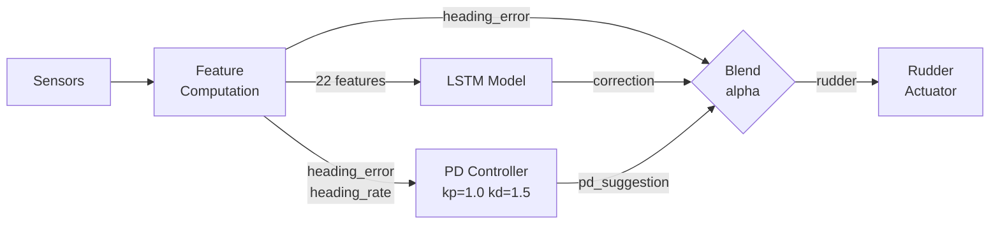
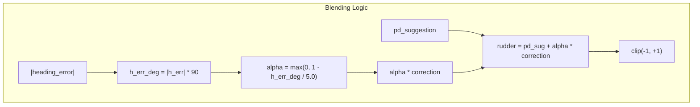
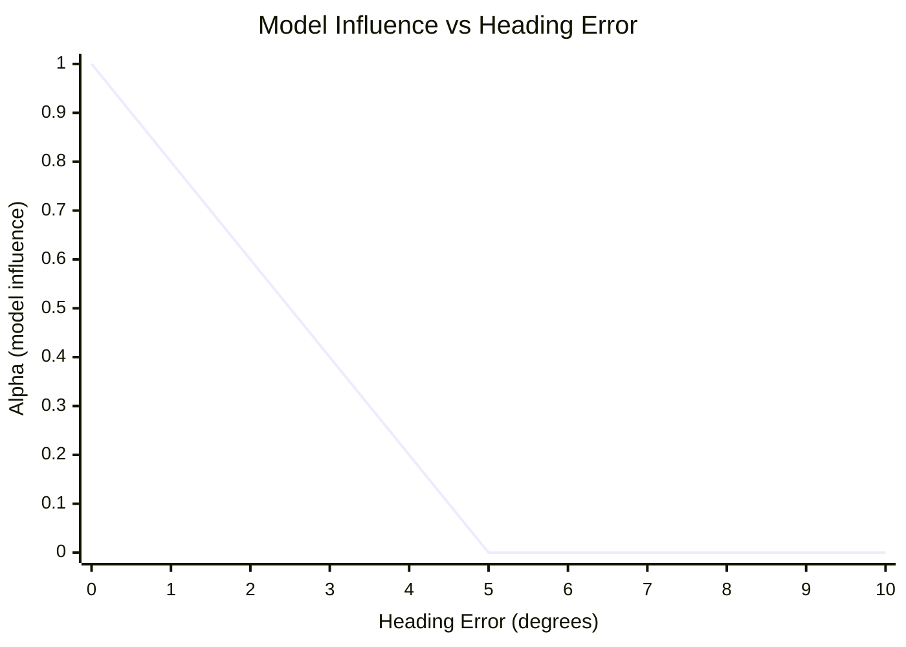
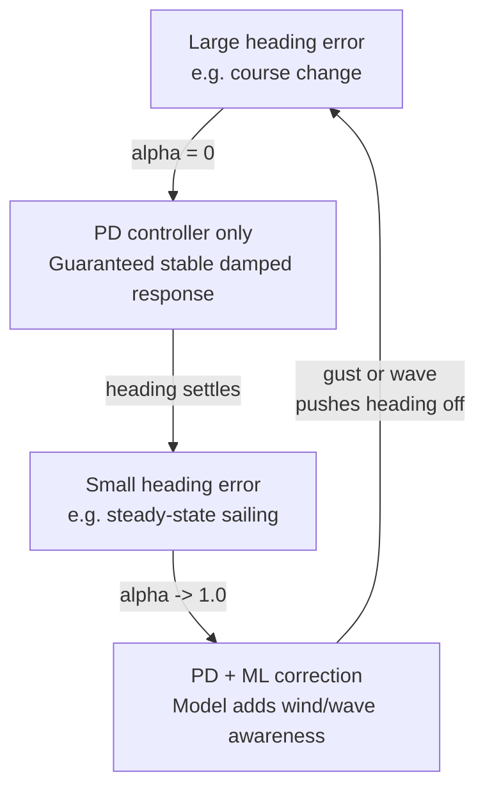

# Blended PD + ML Controller

## Overview

The autopilot uses a blended control strategy where a classical PD controller handles large heading corrections and an LSTM model provides small refinements influenced by wind and wave conditions. The PD controller guarantees stable, damped transient response while the ML model improves steady-state accuracy in conditions the PD cannot model (wind shifts, gusts, cross-seas).



## Control Law

```
alpha = max(0, 1 - |heading_error_deg| / BLEND_FADE_DEG)

rudder = pd_suggestion + alpha * model_correction
```

Where:
- `pd_suggestion` = feature 19, pre-computed as `clip((1.6 * heading_error - 1.5 * heading_rate) / 25, -1, 1)`
- `model_correction` = raw LSTM output (trained on residual labels)
- `alpha` = blending factor, 0.0 to 1.0
- `BLEND_FADE_DEG` = heading error threshold in degrees (currently **5.0 deg**)
- `heading_error_deg` = `|feature[0]| * 90.0` (feature 0 is heading error normalised by 90 deg)



### Blending Behaviour

| Heading Error | Alpha | Who Steers | Example |
|---------------|-------|------------|---------|
| 0 deg | 1.00 | PD + full model | Steady-state holding |
| 2.5 deg | 0.50 | PD + half model | Small disturbance |
| 5+ deg | 0.00 | PD only | Course change, recovery |



## Why This Works

### The Distribution Shift Problem

Imitation learning (behavioral cloning) trains on states visited by the expert. When the model steers in closed-loop, imperfect predictions cause small errors that push the boat into states the expert never visited. The model makes poor predictions in these unfamiliar states, causing larger errors, creating a compounding failure.

Evidence: across 9 training runs, validation loss and closed-loop performance were **uncorrelated** — the best validation loss often produced the worst closed-loop behaviour.

### Why Pure ML Fails for Large Corrections

The model consistently failed to learn the PD controller's derivative (D) term. When approaching a target heading at speed, the PD controller reduces rudder to prevent overshoot (proportional term shrinks, derivative term actively brakes). The model never learned this braking behaviour from MSE loss — it applies assertive rudder but doesn't ease off, causing oscillation.

```
Failure mode (pure ML, compass_large):
t=10  h_err=+0.176  pd_sug=+0.457  model=+0.773  ← PD says ease off, model ignores
t=20  h_err=-0.107  pd_sug=-0.312  model=-0.608  ← overshot, reverses hard
t=30  h_err=+0.166  pd_sug=+0.621  model=+0.497  ← oscillating
```

### Why Pure ML Fails for Wind Mode

In wind mode, heading error propagates through a feedback loop: rudder changes heading, which changes apparent wind angle (AWA). The model needs to sustain large corrections for extended periods — something MSE training on averaged distributions does not teach. DAgger (Dataset Aggregation) was tried and fixed compass mode perfectly but made wind mode worse — the model learned to be passive when AWA errors were large.

### The Blended Solution

The blended approach separates concerns:



1. **Large transients (alpha=0)**: PD handles course changes, tacks, and recovery from disturbances. The PD controller's damped response (kp=1.0, kd=1.5) prevents overshoot and oscillation. This is proven to work — the PD controller passes all CL tests when given enough time to settle.

2. **Steady state (alpha=1)**: The model adds small corrections that account for conditions the PD cannot model: wind shifts, gusts, wave-induced yaw, sail trim effects, and current. These corrections are trained as residuals (expert_rudder - pd_suggestion), so the model only needs to learn what the PD gets wrong.

3. **Smooth transition**: The linear blend ensures no discontinuity as control authority transfers. The fade threshold (5 deg) was chosen empirically — large enough that the model has authority during normal sailing variations, small enough that PD handles any significant heading excursion.

## Implementation

The blending is implemented in three locations that must stay in sync:

| Location | File | Purpose |
|----------|------|---------|
| CL validation | `src/training/train_imitation.py:_run_cl_scenario()` | Training evaluation |
| Real-time inference | `src/main.py:Autopilot._update_control()` | On-boat deployment |
| DAgger collection | `src/training/train_imitation.py:dagger_collect()` | Data collection |

The blend function and `BLEND_FADE_DEG` constant are defined at module level in `train_imitation.py`. The same constant must be replicated in `main.py` for deployment.

### Residual Label Transformation

Training labels are transformed from absolute rudder to residuals at load time in `data_loader.py:FrameDataset.__getitem__()`:

```python
y_val = y_val - float(x[-1, 19])  # label = expert_rudder - pd_suggestion
```

This means the model learns to predict **corrections relative to PD**, not absolute rudder commands. The correction is near zero when PD already does the right thing (most of the time), and non-zero only when conditions require adjustment.

### Model Output Path

```python
# AutopilotInference.predict() returns raw correction (no clip)
correction = model.predict(sequence)      # raw LSTM output, [-1, 1]

# Blend based on heading error
h_err_deg = abs(features[0]) * 90.0
alpha = max(0.0, 1.0 - h_err_deg / BLEND_FADE_DEG)

# Final rudder command
rudder_norm = clip(pd_suggestion + alpha * correction, -1, 1)
rudder_deg = rudder_norm * 25.0           # physical range +/- 25 degrees
```

## Validated Results

With `BLEND_FADE_DEG = 5.0`:

| Test | Criterion | Result | SS Error | Max Error |
|------|-----------|--------|----------|-----------|
| compass_small (5 deg error, 120s) | < 5 deg | **PASS** | 0.4 deg | 0.7 deg |
| compass_large (90 deg error, 60s) | < 10 deg | **PASS** | 0.6 deg | 1.3 deg |
| wind_awa_hold (10 deg AWA offset, 120s) | < 10 deg | **PASS** | 5.5 deg | 12.0 deg |

### Diagnostic Trace: compass_large

Shows the handoff from PD to model during a 90 deg course change:

```
time  h_err   alpha  rudder  heading  (target: 135)
 0.0  +0.999   0.00  +25.0°   45.0°   PD only: full rudder
 5.0  +0.734   0.00  +25.0°   68.7°   PD only: still turning
10.0  +0.081   0.00   -5.3°  127.8°   PD only: braking (D-term)
20.0  -0.059   0.00   -2.1°  140.3°   PD only: settling overshoot
30.0  -0.011   0.81   -0.8°  135.9°   model taking over, settled
59.0  -0.003   0.94   -0.6°  135.3°   model in control, fine-tuning
```

### Diagnostic Trace: wind_awa_hold

Shows PD handling initial correction, model fine-tuning at steady state:

```
time  h_err   alpha  rudder  AWA      (target AWA: -45)
 0.0  -0.109   0.00  -15.9°  -54.1°   PD only: correcting
 5.0  +0.201   0.00  +25.0°  -31.0°   PD only: reverse correction
30.0  -0.055   0.01  -12.8°  -49.3°   PD dominant, settling
60.0  -0.003   0.94   +7.8°  -45.2°   model in control: AWA on target
90.0  -0.047   0.15   -7.6°  -48.8°   drift detected, PD reclaims
```

---

# Training Requirements and Guidance

## Data Generation

### Command

```bash
.venv/bin/python -u -m src.simulation.data_generator data/simulated --format binary 2>&1 | tee training-gen.txt
```

### Scenario Mix

The default scenario mix (defined in `data_generator.py`) produces balanced training data:

- 3 wind scenarios: medium_upwind, downwind_vmg, light_air_reaching
- 3 compass scenarios: calm_compass, motoring, mixed_coastal
- 3 error recovery: random mode, 30-90 deg initial errors

This produces ~1.8M training sequences with mirror augmentation.

### Data Quality Checklist

Before training, verify:
- Wind scenarios have balanced tack (target_angle randomized +/-) via `randomize_initial_conditions()`
- Error recovery scenarios include all three modes (compass, wind_awa, wind_twa)
- Wave model is active in all scenarios
- Rate features are populated (roll_rate, awa_rate, rudder_velocity)
- No DAgger .bin files from previous experiments in data/simulated/ (unless intentional)

## Training

### Command

```bash
# Fresh training (recommended after any code changes)
.venv/bin/python -u -m src.training.train_imitation data/simulated -o models --fresh 2>&1 | tee training-$(date +%Y%m%d-%H%M).txt

# Resume from checkpoint (for iterative refinement)
.venv/bin/python -u -m src.training.train_imitation data/simulated -o models 2>&1 | tee training-$(date +%Y%m%d-%H%M).txt
```

### Expected Behaviour with Residual Labels

Because the model learns residuals (expert - PD), training metrics differ from absolute-rudder training:

| Metric | Absolute Labels | Residual Labels | Explanation |
|--------|----------------|-----------------|-------------|
| Val loss | ~0.001 | ~0.013 | Residuals are harder — non-zero only during transients |
| Val MAE | ~0.65 deg | ~1.7 deg | Same reason — larger apparent error |
| Training epochs | 15-18 | 20-23 | Takes longer to converge |

**Do not compare residual val loss to absolute val loss.** The numbers are not comparable. Only CL validation results matter.

### CL Validation

Run after training or standalone:

```bash
# Standalone validation
.venv/bin/python -u -m src.training.train_imitation --validate models/autopilot.onnx 2>&1
```

The three CL tests and their pass criteria:

| Test | Setup | Pass Criterion |
|------|-------|----------------|
| compass_small | 5 deg heading error, 120s, TWS 12 kts | < 5 deg SS error |
| compass_large | 90 deg heading error, 60s, TWS 12 kts | < 10 deg SS error |
| wind_awa_hold | AWA 10 deg off target, 120s, TWS 15 kts | < 10 deg SS error |

### What to Look For in Diagnostics

| Column | Meaning |
|--------|---------|
| h_err_f | Heading error feature (normalised, +/-1.0 = +/-90 deg) |
| pd_sug | PD suggestion feature (what PD controller would command) |
| alpha | Blend factor (0=PD only, 1=PD+model) |
| rud_n | Final rudder command (normalised) |
| rud_deg | Final rudder command (degrees) |

**Healthy patterns:**

| Pattern | Meaning |
|---------|---------|
| alpha=0 during large errors, alpha~1 when settled | Blend working correctly |
| rud_n tracks pd_sug when alpha=0 | PD in full control |
| Small rud_n adjustments when alpha~1 | Model making fine corrections |
| Heading converges monotonically after initial transient | No oscillation |

**Warning patterns:**

| Pattern | Meaning | Action |
|---------|---------|--------|
| Oscillation when alpha > 0.5 | Model corrections too large | Reduce BLEND_FADE_DEG |
| Very slow settling in wind mode | Model not contributing enough | Increase BLEND_FADE_DEG |
| alpha never reaches 1.0 | Heading never fully settles | Check PD gains or scenario setup |

## Tuning BLEND_FADE_DEG

The fade threshold controls where PD hands off to the model. It can be adjusted without retraining.

| BLEND_FADE_DEG | Model Authority | Tested Result |
|----------------|-----------------|---------------|
| 10 deg | Model active within 10 deg of target | compass PASS, wind_awa FAIL (14.6 deg) |
| **5 deg** | Model active within 5 deg of target | **All PASS** (0.4, 0.6, 5.5 deg) |

To test a new value, change `BLEND_FADE_DEG` in `train_imitation.py` and run:
```bash
.venv/bin/python -u -m src.training.train_imitation --validate models/autopilot.onnx 2>&1
```

When tuning:
- **Too high** (e.g., 15-20 deg): model fights PD during transients, causing oscillation
- **Too low** (e.g., 1-2 deg): model barely contributes, loses wind/wave benefit
- **Sweet spot**: just above the steady-state error the PD achieves alone (~3-5 deg)

## Lessons Learned

### What Worked

1. **PD suggestion as feature (index 19)**: Pre-computing the PD output and injecting it as a feature gives the model a damped control reference. This was the single most impactful feature addition.

2. **Residual labels**: Training on `expert - pd_suggestion` instead of absolute rudder focuses the model on learning what PD gets wrong, rather than re-learning what PD already handles.

3. **Error-magnitude blending**: Letting PD handle large transients eliminates the oscillation/divergence problems that plagued pure ML approaches. The model only needs to be accurate near the target — exactly where training data is most representative.

4. **Mode flag (feature 1)**: Encoding steering mode (compass=0.0, awa=0.5, twa=1.0) lets the model learn mode-specific behaviour without separate models.

5. **Mirror augmentation with feature 16 zeroing**: Port/starboard mirroring doubles effective data. Zeroing computed_heading (feature 16) in mirrored samples prevents the model from distinguishing real vs mirrored state.

6. **Tack randomisation**: Randomising target_angle sign in wind scenarios ensures balanced port/starboard data. Without this, the model developed a systematic starboard bias.

### What Did Not Work

1. **Pure behavioral cloning**: 9 training runs with various feature engineering, scenario mixes, and hyperparameter changes. Best result was 2/3 CL tests passing. The fundamental problem — distribution shift — cannot be solved by data engineering alone.

2. **DAgger (Dataset Aggregation)**: 6 DAgger iterations across 2 runs. Fixed compass mode perfectly (0.5 deg SS error) but made wind mode dramatically worse (49 deg -> 68 deg). The model learned to be passive in wind mode because DAgger-collected states had uniformly saturated expert labels.

3. **Doubling heading_rate signal**: Changing normalisation from /30 to /15 deg/s was intended to make the D-term more visible. The model used the amplified rate as another proportional term, making oscillation worse.

4. **More wind scenarios**: Increasing wind scenario proportion from 33% to 45% diluted compass/recovery data without improving wind performance.

5. **Wind-specific error recovery scenarios**: Adding dedicated wind_awa recovery scenarios reduced compass recovery data, causing regression.

### Key Insights

- **Validation loss is meaningless for CL performance.** The best val loss run (0.000964) had the worst CL performance. Only closed-loop testing reveals actual steering quality.

- **The model cannot learn damping from MSE loss.** The heading_rate derivative term requires the model to reduce rudder as rate increases — a behaviour that is averaged away by MSE on the full training distribution.

- **Separation of concerns is essential.** The PD controller is simple, interpretable, and provably stable for linear corrections. The ML model adds value only where PD falls short: condition-specific adjustments for wind, waves, and sail trim that vary nonlinearly with conditions.

- **Start with the simplest working controller and add ML incrementally.** The blended approach works because it cannot be worse than PD alone (at worst, alpha=0 everywhere). This is a safer deployment strategy than trusting ML for the full control loop.

## Architecture Reference

### Feature Vector (22 features)

| Index | Feature | Normalisation | Mirror |
|-------|---------|---------------|--------|
| 0 | heading_error | /90 deg | Negate |
| 1 | mode_flag | compass=0.0, awa=0.5, twa=1.0 | Keep |
| 2 | heading_rate | /30 deg/s | Negate |
| 3 | roll | /45 deg | Negate |
| 4 | pitch | /30 deg | Keep |
| 5 | roll_rate | /30 deg/s | Negate |
| 6 | AWA | /180 deg | Negate |
| 7 | AWA_rate | /10 deg/s | Negate |
| 8 | AWS | /60 kts | Keep |
| 9 | TWA | /180 deg | Negate |
| 10 | TWS | /60 kts | Keep |
| 11 | STW | /25 kts | Keep |
| 12 | SOG | /25 kts | Keep |
| 13 | COG_error | /45 deg | Negate |
| 14 | rudder_position | zeroed | Negate |
| 15 | rudder_velocity | /10 deg/s | Negate |
| 16 | computed_heading | /360 | Zeroed in mirror |
| 17 | VMG_up | /15 kts | Keep |
| 18 | VMG_down | /20 kts | Keep |
| 19 | PD_suggestion | clip((1.6*err - 1.5*rate)/25) | Negate |
| 20 | placeholder | 0.0 | Keep |
| 21 | wave_period | /15 s | Keep |

### Model Architecture

```
Input (20 timesteps x 22 features)
  -> Feature Mix: Linear(22, 256) + ReLU
  -> BatchNorm1d(20)
  -> LSTM(256, 128)
  -> Dropout(0.3)
  -> LSTM(128, 64)
  -> Dropout(0.3)
  -> Linear(64, 32) + LeakyReLU
  -> Linear(32, 1) + Tanh
Output: correction in [-1, 1]
```

Parameters: 255,337 (~1 MB). Deploys as ONNX on Raspberry Pi 4.

### Training Run History

| Run | compass_small | compass_large | wind_awa | CL Score | Method |
|-----|--------------|--------------|----------|----------|--------|
| 26-4 | PASS 2.2 | PASS 9.6 | FAIL 38.8 | 16.8 | BC + mode flag |
| 26-8 | FAIL 18.1 | PASS 2.2 | FAIL 38.5 | 19.6 | BC + PD suggestion feat |
| 26-10 | PASS 0.7 | PASS 3.2 | FAIL 49.2 | 17.7 | DAgger initial |
| 26-10 D3 | PASS 0.9 | PASS 1.0 | FAIL 68.0 | 23.3 | DAgger iter 3 |
| 26-12 | FAIL 8.4 | PASS 1.6 | FAIL 20.2 | 10.0 | PD residual |
| 27-1 | PASS 0.2 | FAIL 17.5 | FAIL 15.6 | 11.1 | PD residual (retrained) |
| **27-1 blend** | **PASS 0.4** | **PASS 0.6** | **PASS 5.5** | **2.2** | **PD residual + blend (5 deg)** |
