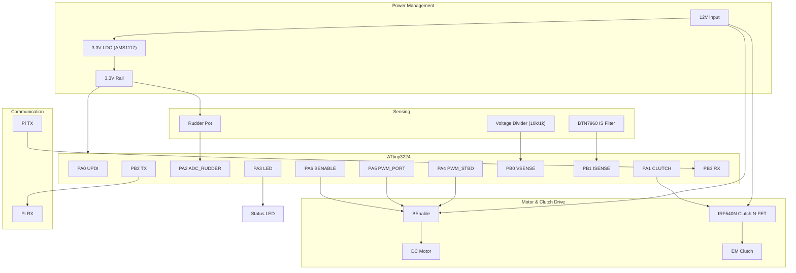

# Actuator Hardware Design

This document specifies the hardware design for the Actuator Controller, based on the ATtiny3224 firmware requirements and the actual PCB netlist.

## System Overview

The Actuator Controller is responsible for closed-loop control of a marine rudder actuator. It interfaces with a high-current DC motor, an electromagnetic clutch, and a rudder position potentiometer. It communicates with a host (Raspberry Pi) via Serial.

## Pinout (ATtiny3224)

| Pin | Name | Net Name | Function | Type | Description |
|-----|------|----------|----------|------|-------------|
| 1 | VCC | +3V3 | Power | Power | System 3.3V Supply |
| 2 | PA4 | PWMStbd | PWM_STBD | Output | PWM drive for Starboard direction (TCA0 WO4) |
| 3 | PA5 | PWMPort | PWM_PORT | Output | PWM drive for Port direction (TCA0 WO5) |
| 4 | PA6 | BEnable | BRIDGE_EN | Output | H-Bridge Enable (High = Enabled) |
| 5 | PA7 | - | NC | - | Unconnected |
| 6 | PB3 | RX | RX | Input | Serial RX from Pi |
| 7 | PB2 | TX | TX | Output | Serial TX to Pi |
| 8 | PB1 | ISense | ADC_CURRENT | Analog | BTN7960 Current Sense (IS) |
| 9 | PB0 | VSense | ADC_VOLTAGE | Analog | Supply voltage (divider) |
| 10 | PA0 | UDPI | UPDI | I/O | Programming interface (via 470R) |
| 11 | PA1 | Clutch | CLUTCH | Output | N-FET gate for Clutch |
| 12 | PA2 | Rudder | ADC_RUDDER | Analog | Rudder potentiometer input |
| 13 | PA3 | - | LED | Output | Status LED (via 1k) |
| 14 | GND | GND | Power | Power | Ground |

## Subsystems

### 1. Power Management
- **Input**: 12V DC (nominal). Fused via 30A blade fuse (F2).
- **Regulation**: 3.3V output for MCU and logic via AMS1117-3.3 (U3).
- **Filtering**: Bulk electrolytic capacitors and ceramic decoupling (100nF/10uF).

### 2. Motor Drive (H-Bridge)
- **Implementation**: Dual high-current half-bridges (2x BTN7960TA, Q2 & Q3).
- **Control**: Two PWM pins (PA4, PA5) and one Enable pin (PA6).
- **Logic**: PA6 must be HIGH for the bridge to operate.

### 3. Clutch Control
- **Implementation**: IRF540N N-channel MOSFET (Q1).
- **Protection**: SS34 Schottky diode (D1) across the clutch terminals.

### 4. Current & Voltage Sensing
- **Current Sensor**: BTN7960 IS pins joined to PB1.
- **Voltage Sensor**: Resistor divider (10k R3 / 1k R12) on the 12V rail to PB0.

### 5. Position Sensing
- **Sensor**: 10kΩ linear potentiometer.
- **Wiring**: Connected between 3.3V and GND, wiper to PA2.
- **Protection**: US1J diodes (D2/D3) on the rudder input line.

### 6. Communication
- **Interface**: UART (115200, 8N1) via J7.
- **Logic Levels**: 3.3V logic (native to ATtiny3224 in this design).

## Layout Guidelines

1. **High Current Paths**: Use wide traces or copper pours for 12V, GND (Motor), and Motor outputs. 15A requires substantial copper (e.g., 2oz copper, >5mm trace width).
2. **Grounding**: Use a single-point ground or separate Power GND and Logic GND, joined at a single point (Star Ground) to prevent motor noise from affecting ADC/MCU.
3. **Decoupling**: Place 0.1uF capacitors as close as possible to the MCU and INA219 power pins.
4. **Current Sensing**: Connect the L_IS and R_IS pins of the BTS7960 module together and then to PA2. Place the 1kΩ/1uF RC filter components as close to the MCU pin as possible.
5. **Connector**: Use robust marine-grade connectors (e.g., Deutsch DT series or screw terminals).

## Assembly & Testing

1. **Bare Board**: Check for shorts between 12V, 5V, and GND.
2. **Power Up**: Apply 12V, verify 5V regulator output.
3. **MCU**: Flash firmware via UPDI.
4. **Current Sense**: Verify ADC readings reflect motor load ($STS message should show current increase under load).
5. **Manual Test**: Use serial commands to engage clutch and drive motor at low PWM.
6. **Calibration**: Perform the $CAL sequence as described in README.md.
