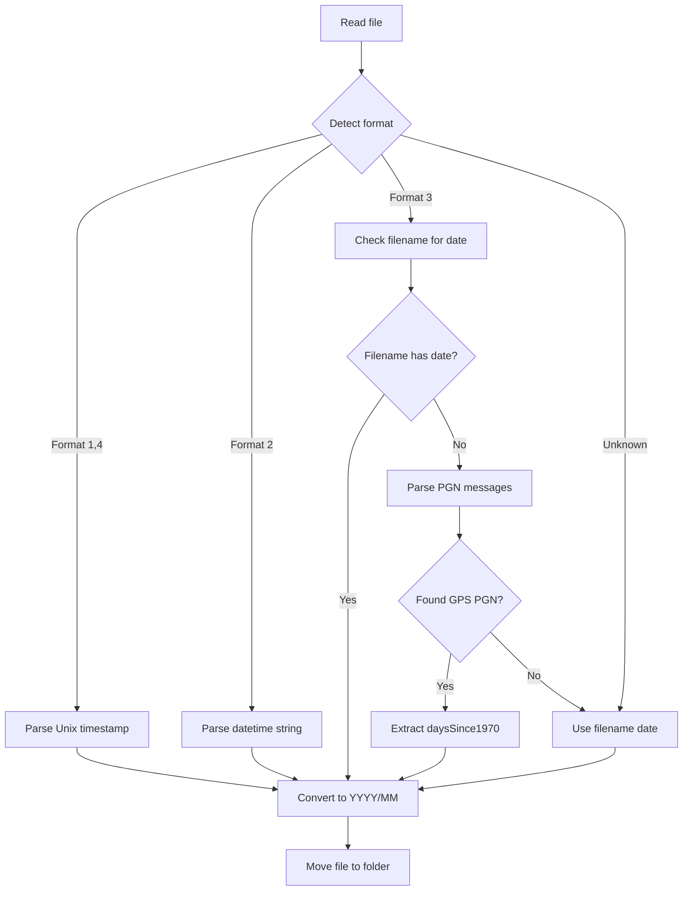

# CAN Log File Organizer

> **Status**: Implemented in [`src/n2k/log_organizer.py`](../src/n2k/log_organizer.py)

## Overview

Python utilities to parse various CAN log formats, extract capture dates from timestamps or GPS PGN messages, and organize files into YYYY/MM directory structure.

## File Format Analysis

The 18 files in [`n2klogs/raw/`](../n2klogs/raw/) use 4 distinct formats:

### Format 1: Standard candump (Unix timestamp)
- **Files**: `candump-2017-11-19_105919.log`, `candump-2018-05-07-15-18.log`, `candump-2018-05-07-15-39.log`, `candump-2018-05-19-1-orig.log`, `candump-2018-05-19-1.log`
- **Pattern**: `(1511089161.425011) can0 18EEFF0B#150069E700BEA1C0`
- **Date extraction**: Direct Unix timestamp conversion

### Format 2: Analyzed CSV (human-readable datetime)
- **Files**: `cananalysed120-*.log`, `cananalysed80-*.log` (4 files)
- **Pattern**: `2018-05-12-13:51:08.613,2,127250,204,255,8,ff,be,...`
- **Date extraction**: Parse ISO-like datetime string

### Format 3: Hardware timestamp with packed CAN frame (relative time)
- **Files**: `capture20240411.txt`, `startuProblems-20240414.txt`, `output2converted.log`, `testcapture.txt`, `test.txt`
- **Pattern**: `(386.912093) ffffffffcd0df18908000000fcf8ff7fff7fffffa8fe1710`
- **Date extraction**: Filename dates preferred, fallback to GPS PGN messages (126992, 129029, or 129033)

### Format 4: slcan candump (Unix timestamp)
- **Files**: `output2candump.log`, `startuProblems-20240414.candump.txt`
- **Pattern**: `(1713293479.152000) slcan0 89f11200#ff690aff7fff7ffd`
- **Date extraction**: Direct Unix timestamp conversion

### Skip: Non-CAN log
- **File**: `testdump.txt` - Contains USB device info, not CAN messages

## Date Extraction Strategy



### Key PGNs for Date Extraction
- **PGN 126992 (System Time)**: Contains `Date` (days since 1970-01-01) and `Time` (seconds since midnight)
- **PGN 129029 (GNSS Position)**: Contains `daysSince1970` and `secondsSinceMidnight`
- **PGN 129033 (Time and Date)**: Contains `Date`, `Time`, and local offset

For Format 3 (hardware timestamps), the CAN ID must be decoded from the packed binary format:
- Bytes layout: `ffffffff` + 4-byte CAN ID (little-endian) + 1-byte DLC + padding + 8-byte data + hw timestamp
- Extract PGN from CAN ID using NMEA 2000 29-bit identifier structure

## Implementation

### File: [`src/n2k/log_organizer.py`](../src/n2k/log_organizer.py)

```python
# Core classes
class LogFormat(Enum):
    CANDUMP = "candump"           # Standard candump with Unix timestamp
    ANALYZED_CSV = "analyzed"     # Human-readable CSV format  
    HARDWARE_TS = "hardware_ts"   # Hardware timestamp with packed frames
    SLCAN = "slcan"               # slcan candump format
    UNKNOWN = "unknown"

class CANLogOrganizer:
    def detect_format(self, filepath: Path) -> LogFormat
    def extract_date(self, filepath: Path) -> Optional[date]
    def organize_files(self, src_dir: Path, dest_dir: Path, dry_run: bool)
```

### Usage

```bash
# Dry run (default) - shows what would happen
python3 -m src.n2k.log_organizer n2klogs/raw

# Execute - actually moves files
python3 -m src.n2k.log_organizer n2klogs/raw --execute

# Custom destination
python3 -m src.n2k.log_organizer n2klogs/raw --dest-dir n2klogs/organized --execute
```

## Expected Output Structure

```
n2klogs/raw/
  2017/
    11/
      candump-2017-11-19_105919.log
  2018/
    01/
      test.txt
      testcapture.txt
    05/
      candump-2018-05-07-15-18.log
      candump-2018-05-07-15-39.log
      candump-2018-05-19-1.log
      candump-2018-05-19-1-orig.log
      cananalysed120-2018-05-07-15-18.log
      cananalysed120-2018-05-07-15-39.log
      cananalysed80-2018-05-07-15-18.log
      cananalysed80-2018-05-07-15-39.log
  2024/
    04/
      capture20240411.txt
      startuProblems-20240414.txt
      startuProblems-20240414.candump.txt
      startuProblems2-20240414.candump.txt
      output2candump.log
  unknown/
    output2converted.log
    testdump.txt
```

## Test Results

Successfully processes all 18 files:
- 16 files with valid dates → organized into `YYYY/MM/` folders
- 2 files without determinable dates → `unknown/` folder
