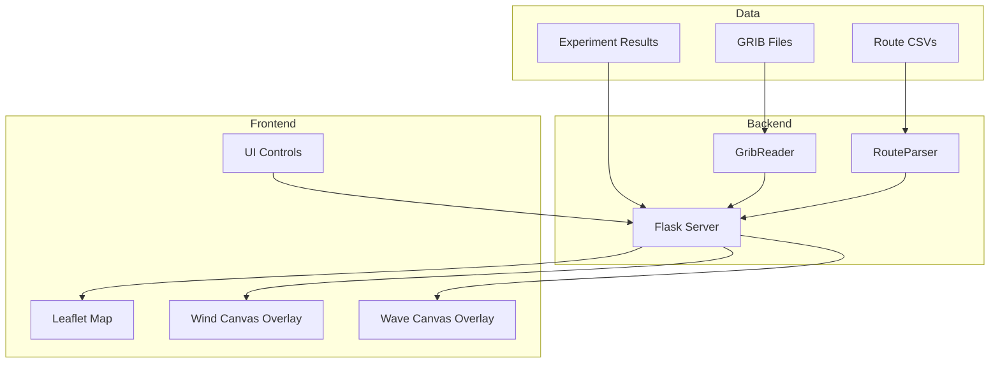

# GRIB Weather Visualization Plan

## Objective

Build a web-based visualization tool for GRIB weather files that displays wind and wave data overlaid on OpenSeaMap, with the ability to display planned passages and experiment result tracks.

## Architecture



## Components

### 1. Python Flask Server (`vis/gribs/server.py`)

REST API endpoints:
- `GET /` - Serve frontend
- `GET /api/metadata` - GRIB file metadata and available times
- `GET /api/wind?time=<ISO>` - Wind grid data (u, v, speed, direction)
- `GET /api/waves?time=<ISO>` - Wave data (height, period, direction, swell)
- `GET /api/routes` - List available route files
- `GET /api/route/<name>` - Parse and return route waypoints
- `GET /api/results` - List experiment result directories
- `GET /api/result/<name>` - Return track time series data
- `GET /api/debug/grib` - List all GRIB parameters (debug)

### 2. Frontend (`vis/gribs/static/`)

**index.html**: Main page structure with:
- Leaflet map container
- Time slider for GRIB data
- Passage time slider for track animation
- Layer toggles (wind, waves, route, results)
- Particle control sliders (density, size, tail, speed)
- Tooltips for wind/wave/boat data

**app.js**: JavaScript application:
- Leaflet map with OpenSeaMap tiles
- Canvas overlays for wind particles and wave gradients
- Animated wind streamlines (particle system)
- Route and track polyline rendering
- Boat icon markers with interpolated positions
- Time synchronization between GRIB and passage sliders

**style.css**: Styling for controls, legends, tooltips

### 3. Wind Visualization

Animated particle streamlines inspired by windy.com:
- Particles spawn randomly within data bounds
- Velocity interpolated from nearest GRIB grid point
- Particle speed proportional to wind speed
- Trail fade effect for motion visualization
- Bounds checking to prevent rendering outside data coverage

### 4. Wave Visualization

Transparent gradient overlay:
- Color scale from blue (calm) to red/purple/white (severe)
- 0-9m height range with smooth gradients
- Opacity controlled by wave height

### 5. Passage/Track Display

Route visualization:
- Dashed blue polyline for planned route
- Circle markers at waypoints
- Hollow blue triangle for planned boat position

Result track visualization:
- Solid colored polylines (multiple tracks supported)
- Filled triangle markers for actual boat positions
- Color-coded for easy comparison

Time synchronization:
- Passage slider controls boat icon positions
- GRIB slider syncs automatically when passage moves
- Play/pause animation with reset

## Implementation Phases

### Phase 1: Core Visualization ✓
1. Flask server with GRIB data endpoints
2. Leaflet map with OpenSeaMap tiles
3. Static wind arrow rendering
4. Wave height gradient overlay
5. Time slider for GRIB navigation

### Phase 2: Enhanced Wind Display ✓
1. Animated particle streamlines
2. Particle controls (density, size, tail, speed)
3. Speed-proportional particle velocity
4. Bounds checking for data coverage

### Phase 3: Passage Integration ✓
1. Route loading and display
2. Result track loading and display
3. Boat icon markers with heading rotation
4. Passage time slider
5. Time synchronization with GRIB slider
6. Boat tooltips with sailing data

## Bug Fixes Applied

1. **Static file 404s**: Updated HTML to use `/static/` prefix for CSS/JS
2. **Wind direction 90° off**: Negated vy component in particle velocity calculation (canvas Y-axis inversion)
3. **Route loading null error**: Fixed `drawRoute()` to preserve `routeData` reference before clearing layers
4. **Missing wave data in tooltip**: Enhanced server to scan all wave parameters from GRIB files
5. **Wind particles outside coverage**: Added bounds and proximity checks in `getWindAtPixel()`
6. **AWA/AWS missing**: Added fields to time series recording; added fallback calculation from TWS/TWA/STW

## Dependencies

```toml
[project.optional-dependencies]
viz = [
    "flask>=3.0.0",
]
```

Also requires: cfgrib, xarray, numpy (from main dependencies)

## Usage

```bash
# Install dependencies
uv sync --extra viz

# Run server
python vis/gribs/server.py \
    --grib-dir data/experiment1/grib \
    --routes-dir data/experiment1/route \
    --results-dir results \
    --port 5000

# Open browser
open http://localhost:5000
```
