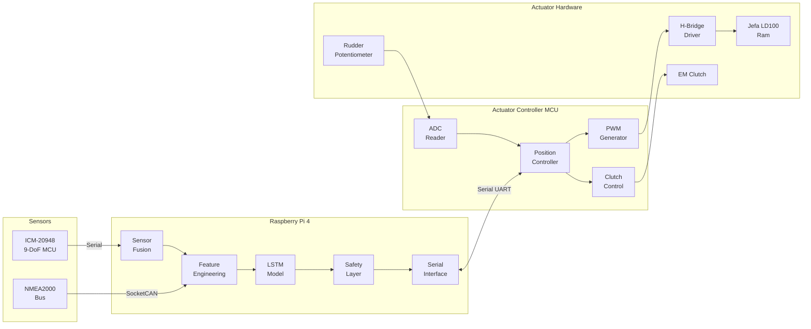
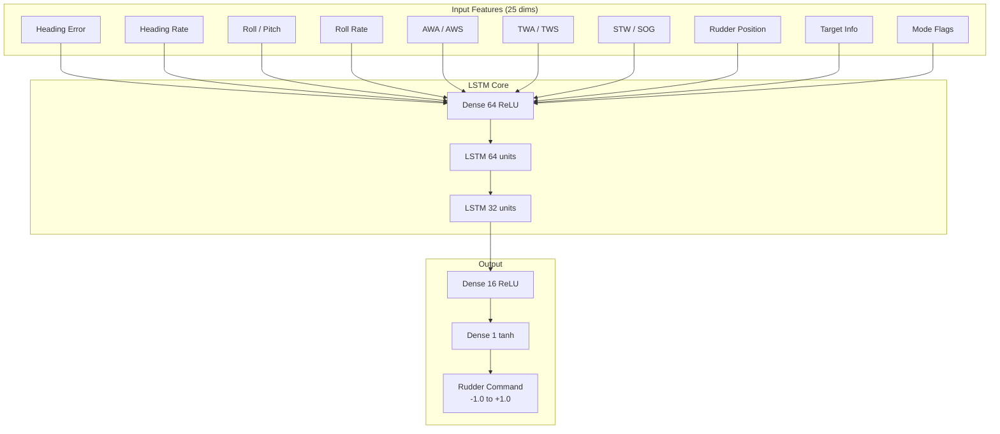
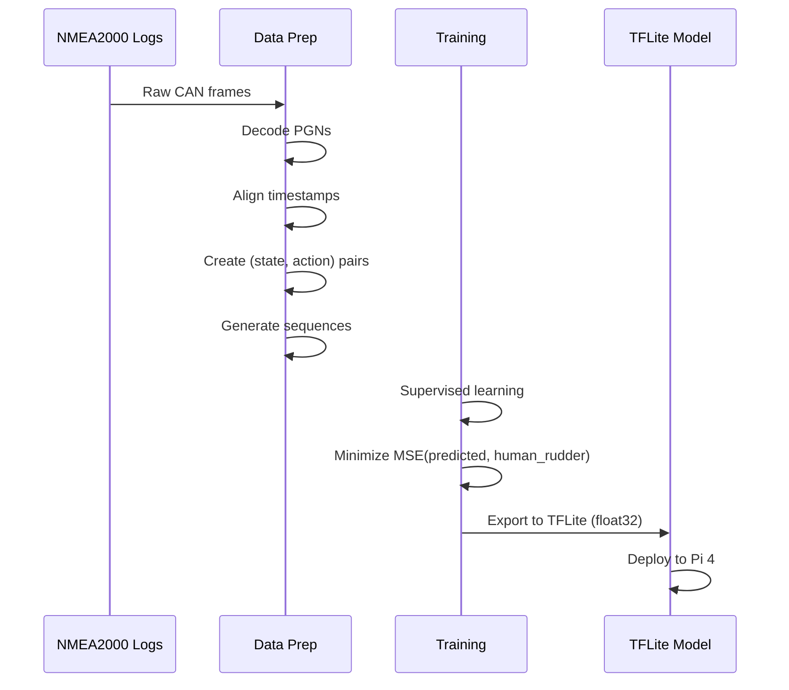
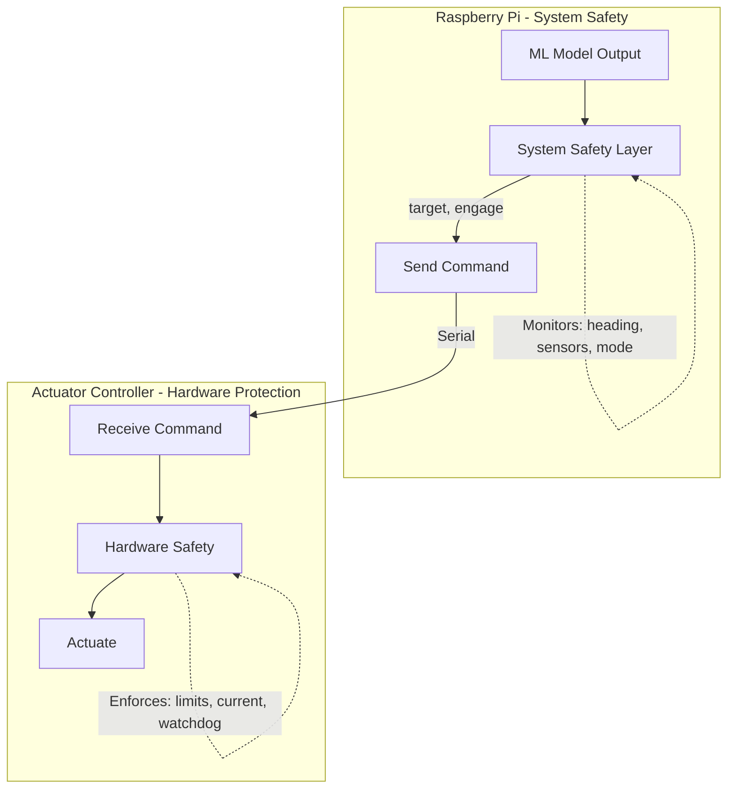

# ML-Based Yacht Autopilot for Pogo 1250

An end-to-end neural network autopilot that learns from human helming to steer a high-performance sailing yacht.

## Overview

This system replaces traditional PID/gain-based autopilots with a neural network that directly outputs rudder commands from sensor observations. The model learns yacht dynamics implicitly through imitation learning from logged human helming sessions, then fine-tunes in real-time while in standby mode.



---

## Current Status (January 2026)

| Phase | Status | Notes |
|-------|--------|-------|
| **Simulation Framework** | ✅ Complete | Yacht dynamics, wind/wave models, scenario generation |
| **ML Training Pipeline** | ✅ Complete | Imitation learning with MLflow, ONNX export |
| **Experiment Validation** | ✅ Complete | Passage simulation matches baseline PD controller |
| **Sign Convention Fix** | ✅ Complete | Aligned feature engineering with NMEA2000 conventions |
| **Hardware Simulators** | 🔄 In Progress | IMU, Actuator, CAN simulators for full-stack testing |
| **Physical Hardware** | ⏳ Pending | PCB fabrication, bench testing, sea trials |

### Completed Milestones

1. **Simulation Framework**
   - Yacht dynamics model with realistic heading/speed response
   - Wind model with shifts, gusts, and oscillations
   - Wave model for pitch/roll motion
   - PD-based HelmController for training data generation
   - Scenario-based generation with warm-up periods and error recovery

2. **Training Pipeline**
   - Imitation learning trainer with MLflow experiment tracking
   - Data loader with mode transition filtering
   - ONNX export for embedded deployment (311 KB model)
   - Model achieves 0.82° MAE on validation data

3. **Passage Simulation Experiment**
   - 62-leg, 112nm simulated passage
   - Navigator with route following and mode selection
   - Metrics: XTE, heading error, polar performance, ETA
   - ML model matches baseline: 212m mean XTE, 0.5° mean heading error

4. **Sign Convention Alignment**
   - Fixed feature engineering to use `error = target - current`
   - Documented in `.cursor/rules/nmea2000-conventions.mdc`
   - See `docs/feature_engineering_sign_convention.md`

---

## User Review Required

> [!IMPORTANT]
> **Raw CAN Log Format**: I need to understand the format of your existing NMEA2000 logs to design the data ingestion pipeline. Can you share a sample or describe the format?

> [!IMPORTANT]
> **Helmsperson Input Recording**: The model needs to learn the **relationship** between conditions and rudder movements. Do your logs include rudder position data, or will we need to add rudder logging during training voyages?

> [!WARNING]
> **Training Data Quality**: End-to-end models are only as good as the demonstrations they learn from. The training data should include:
> - Experienced helming in various conditions (light, medium, heavy air)
> - Both upwind and downwind sailing
> - Various sea states
> - **Good** helming only (poor technique will be learned)

> [!CAUTION]
> **First Sea Trials**: The initial ML model will require extensive supervised testing. Plan for:
> - Human helm ready to override at all times
> - Calm conditions for first tests
> - Gradual increase in autonomy as confidence grows

---

## Proposed Changes

### Hardware Layer

#### [NEW] [hardware_design.md](../docs/hardware_design.md)
Complete hardware specification document including:

| Component | Model | Purpose | Interface |
|-----------|-------|---------|----------|
| Computer | Raspberry Pi 4 (4GB) | Main controller | - |
| CAN Interface | [CandleLite](https://linux-automation.com/en/products/candlelight.html) | NMEA2000 communication | USB → SocketCAN (`can0`) |
| 9-DoF IMU | ICM-20948 + ATtiny3224 | Heading, attitude, rates | Serial (115200 baud) |
| Actuator Controller | ATtiny3226 | Closed-loop rudder control, clutch | Serial (115200 baud) |
| Motor Driver | BTS7960 H-Bridge | Jefa LD100 actuation | 2× PWM from Actuator MCU |
| Clutch Driver | N-FET + flyback diode | Electromagnetic clutch | GPIO from Actuator MCU |
| Current Sense | Shunt resistor + op-amp | Motor load monitoring | ADC on Actuator MCU |
| Power | 12V → 5V DC-DC | Pi + sensors power | - |

**CAN Bus Setup:**
```bash
# CandleLite appears as gs_usb device, bring up as can0
sudo ip link set can0 up type can bitrate 250000
```

**IMU Interface Decision: Serial vs I²C**

| Factor | Serial (UART) | I²C |
|--------|---------------|-----|
| Cable length | Up to 10m with proper driver | ~1m max reliable |
| Noise immunity | Better (differential signaling possible) | Susceptible to interference |
| Isolation | Easy with optocouplers | Requires level shifters |
| Wiring | 4 wires (TX, RX, VCC, GND) | 4 wires (SDA, SCL, VCC, GND) |
| Recommendation | **Preferred** for mounting away from Pi | Only if co-located |

> [!TIP]
> **Recommendation**: Use **Serial** with the ICM-20948 on a dedicated microcontroller (e.g., Arduino Pro Mini or RP2040). This provides:
> - Physical isolation from Pi electrical noise
> - Ability to mount IMU remotely (e.g., near centerline, away from electronics)
> - Consistent 100Hz output regardless of Pi load
> - Simple protocol: MCU runs sensor fusion, sends heading/rates over serial

**Actuator Controller Interface:**
- Dedicated serial link (115200 baud) between Pi and Actuator Controller MCU
- Pi sends target rudder angle commands; MCU handles closed-loop position control
- MCU generates 2 PWM signals (10kHz) for H-Bridge: port and starboard drive
- Electromagnetic clutch engaged only when autopilot is active
- Watchdog timeout: clutch auto-disengages if no command received within 2s
- Lock-to-lock: 15s at full speed → ~4°/s rudder rate

---

### Sensor Fusion & Feature Engineering

#### [NEW] [imu_fusion.py](../src/sensors/imu_fusion.py)
Madgwick AHRS filter implementation for ICM-20948:
- 100Hz internal fusion rate
- Outputs: heading, pitch, roll, yaw_rate, pitch_rate, roll_rate
- Magnetometer calibration routine (hard/soft iron compensation)

#### [NEW] [nmea2000_interface.py](../src/sensors/nmea2000_interface.py)
NMEA2000 bus interface using `python-can` + `nmea2000` library:
- Uses standard Linux SocketCAN interface (`can0`) with CandleLite adapter
- Decodes relevant PGNs at their natural rates

> [!IMPORTANT]
> **PGN Update Rates from NMEA2000 bus are ~1Hz**, not 10Hz. This is why the dedicated 100Hz IMU is critical for the control loop.

- Key PGNs (all ~1Hz from bus):
  - **130306** Wind Data: AWA, AWS
  - **128259** Speed: STW
  - **129026** COG/SOG: COG, SOG  
  - **127250** Vessel Heading: magnetic heading (used for calibration, not control)
  - **127251** Rate of Turn: ROT (supplementary)
  - **129029** GNSS Position: lat, lon

**Implication for Control Loop:**
```
Data Source           | Rate   | Used For
----------------------|--------|---------------------------
ICM-20948 (IMU)       | 100Hz  | Heading, rates, attitude → PRIMARY control
Actuator Controller   | 20Hz   | Rudder angle, clutch status, V/I → feedback
NMEA2000 bus          | 1Hz    | Wind, speed, GPS → SECONDARY context
```

The ML model runs at 10Hz but the NMEA2000 values are held/interpolated between updates. The IMU provides the high-frequency feedback essential for stable steering. The Actuator Controller reports rudder position and status back to the Pi for monitoring and ML input features.

---

### ML Model Architecture

> [!NOTE]
> This is the **core of your request** - the detailed ML model specification.

#### [NEW] [autopilot_model.py](../src/ml/autopilot_model.py)

**Model Type:** Recurrent Neural Network (LSTM-based)

**Rationale:** 
- Sailing requires temporal context (wave patterns, wind shifts, boat momentum)
- LSTM captures these temporal dependencies naturally
- Lightweight (~45k params) runs comfortably on Raspberry Pi 4 in float32



##### Input Features (25 dimensions)

| # | Feature | Source | Normalization | Rationale |
|---|---------|--------|---------------|-----------|
| 1 | `heading_error` | computed | ÷180° | Primary steering signal |
| 2 | `heading_error_integral` | computed | clip ±1 | Accumulated error (wind up prevention) |
| 3 | `heading_rate` | IMU | ÷30°/s | Damping information |
| 4 | `roll` | IMU | ÷45° | Heel angle (reef decision, comfort) |
| 5 | `pitch` | IMU | ÷30° | Pitching motion |
| 6 | `roll_rate` | IMU | ÷30°/s | Dynamic stability |
| 7 | `awa` | N2K | ÷180° | Apparent wind angle |
| 8 | `awa_rate` | computed | ÷10°/s | Wind shift indicator |
| 9 | `aws` | N2K | ÷60kn | Apparent wind speed |
| 10 | `twa` | computed | ÷180° | True wind angle |
| 11 | `tws` | computed | ÷60kn | True wind speed |
| 12 | `stw` | N2K | ÷25kn | Speed through water |
| 13 | `sog` | N2K | ÷25kn | Speed over ground |
| 14 | `cog_error` | computed | ÷180° | Course over ground error |
| 15 | `rudder_position` | Actuator Controller | ÷30° | Current rudder angle |
| 16 | `rudder_velocity` | computed | ÷10°/s | Rudder movement rate |
| 17 | `target_angle` | mode-dependent | ÷180° | Target heading/TWA/AWA |
| 18 | `vmg_upwind` | computed | ÷15kn | Velocity made good upwind |
| 19 | `vmg_downwind` | computed | ÷20kn | Velocity made good downwind |
| 20 | `polar_target_stw` | polar lookup | ÷25kn | Expected speed from polar |
| 21 | `polar_performance` | stw/target | raw (0-1.2) | % of polar speed |
| 22 | `mode_compass` | config | binary | 1 if compass mode |
| 23 | `mode_wind_awa` | config | binary | 1 if AWA mode |
| 24 | `mode_wind_twa` | config | binary | 1 if TWA mode |
| 25 | `wave_period_est` | IMU accel FFT | ÷15s | Estimated wave period |

> [!NOTE]
> **Motor current is intentionally excluded from v1 features.** While the Actuator Controller reports motor current, it is logged for analysis but not used as an ML input because:
> - It's a lagging indicator (current rises *after* movement starts)
> - Likely correlates with existing features (speed, heel, wind pressure)
> - Risk of model learning to minimize current rather than steer optimally
>
> After collecting real sailing data, analyze whether current provides predictive value not captured by other features. If so, add as feature #26 in v2.

##### Network Architecture

```python
import tensorflow as tf

def build_autopilot_model(sequence_length=20, n_features=25):
    """
    End-to-end LSTM autopilot model.
    
    Args:
        sequence_length: Number of timesteps (20 @ 10Hz = 2 seconds history)
        n_features: Input feature dimension
    
    Returns:
        Keras model outputting rudder command [-1, 1]
    """
    inputs = tf.keras.Input(shape=(sequence_length, n_features))
    
    # Initial feature mixing
    x = tf.keras.layers.TimeDistributed(
        tf.keras.layers.Dense(64, activation='relu')
    )(inputs)
    
    # Temporal processing with LSTM
    x = tf.keras.layers.LSTM(64, return_sequences=True)(x)
    x = tf.keras.layers.Dropout(0.2)(x)
    x = tf.keras.layers.LSTM(32, return_sequences=False)(x)
    x = tf.keras.layers.Dropout(0.2)(x)
    
    # Output mapping
    x = tf.keras.layers.Dense(16, activation='relu')(x)
    outputs = tf.keras.layers.Dense(1, activation='tanh')(x)  # [-1, 1]
    
    model = tf.keras.Model(inputs, outputs, name='autopilot_lstm')
    return model
```

**Model Statistics:**
- Parameters: ~45,000 (lightweight for Pi 4)
- Input: 20 timesteps × 25 features = 500 values
- Output: 1 value (rudder command, -1 = full port, +1 = full starboard)
- Inference target: <10ms (100Hz capable, running at 10Hz)

##### Deployment Format

**Default: float32 (no quantization)**

For initial deployment, use full float32 precision:
- Model size: ~180 KB (easily fits in Pi 4's 4GB RAM)
- Inference speed: <10ms on Pi 4 (sufficient for 10Hz control loop)
- No precision loss in LSTM internal states

```python
# Export to TFLite (float32)
converter = tf.lite.TFLiteConverter.from_keras_model(model)
tflite_model = converter.convert()
```

**Optional: Quantization for optimization**

Quantization is an *optional* optimization step, not required for Pi 4 deployment. Only consider if:
- Deploying to more constrained hardware
- Need to reduce power consumption
- Validated that accuracy loss is acceptable

| Format | Model Size | Speed | Precision | When to Use |
|--------|------------|-------|-----------|-------------|
| float32 | 180 KB | Baseline | Full | Default - development & production |
| float16 | 90 KB | ~Same | Good | If size matters, precision important |
| int8 | 45 KB | 2-4x faster | Lower | Constrained hardware only |

> [!WARNING]
> **Do not assume int8 is needed.** Validate any quantized model against held-out data before deployment. LSTM internal states may accumulate quantization errors over the 20-timestep sequence.

If quantization is needed:
```python
# float16 quantization (recommended if size reduction needed)
converter.optimizations = [tf.lite.Optimize.DEFAULT]
converter.target_spec.supported_types = [tf.float16]

# int8 quantization (only if validated on real data)
def representative_dataset():
    for sample in validation_data:
        yield [sample]
converter.representative_dataset = representative_dataset
converter.target_spec.supported_ops = [tf.lite.OpsSet.TFLITE_BUILTINS_INT8]
```

##### Sequence Window

```
Time: ... t-19  t-18  t-17  ...  t-2   t-1   t
           │     │     │         │     │    │
           └─────┴─────┴─────────┴─────┴────┘
                    20 timesteps @ 10Hz
                       = 2 second window
                              ↓
                    LSTM processes sequence
                              ↓
                    Single rudder command
```

**Why 2 seconds?**
- Captures ~1-2 wave cycles in typical offshore conditions
- Long enough to detect wind shifts
- Short enough for responsive steering
- Matches typical human reaction/correction cycle

---

### Training Pipeline

#### [NEW] [train_imitation.py](../src/training/train_imitation.py)

**Phase 1: Imitation Learning (Offline)**



**Loss Function:**
```python
def autopilot_loss(y_true, y_pred):
    """
    Custom loss emphasizing:
    1. Rudder position accuracy (MSE)
    2. Rudder rate smoothness (derivative penalty)
    3. Heading error correlation
    """
    mse = tf.reduce_mean(tf.square(y_true - y_pred))
    
    # Smoothness: penalize rapid rudder changes
    rudder_rate = y_pred[1:] - y_pred[:-1]
    smoothness = tf.reduce_mean(tf.square(rudder_rate))
    
    return mse + 0.1 * smoothness
```

**Training Requirements:**
- Minimum: 10+ hours of high-quality helming data
- Recommended: 50+ hours across varied conditions
- Must include rudder position in logs

**Data Logging (for training and analysis):**

All sensor data is logged at 10Hz for training and post-hoc analysis. This includes values not used as ML features.

| Field | Source | Used in ML | Notes |
|-------|--------|------------|-------|
| timestamp | system | - | Unix timestamp with ms precision |
| heading | IMU | Yes | Magnetic heading (°) |
| pitch, roll | IMU | Yes | Attitude (°) |
| heading_rate, pitch_rate, roll_rate | IMU | Yes | Angular rates (°/s) |
| ax, ay, az | IMU | No | Raw accelerations (for wave analysis) |
| awa, aws | N2K | Yes | Apparent wind |
| stw, sog, cog | N2K | Yes | Speed and course |
| rudder_position | Actuator | Yes | Current angle (°) |
| rudder_target | Actuator | No | Commanded angle (°) |
| clutch_engaged | Actuator | No | Boolean |
| motor_voltage | Actuator | No | Supply voltage (V) |
| **motor_current** | Actuator | **No (v1)** | Motor load (A) - logged for future analysis |
| fault_code | Actuator | No | MCU fault status |
| mode | System | Yes | STANDBY, COMPASS, WIND_AWA, etc. |
| target_heading/twa/awa | System | Yes | Mode-specific target |

> [!TIP]
> **Future analysis:** After collecting sailing data, use logged `motor_current` to investigate:
> - Correlation with existing features (speed, heel, wind)
> - Predictive value for steering resistance
> - Whether adding as feature #26 improves model performance

---

#### [NEW] [online_learning.py](../src/training/online_learning.py)

**Phase 2: Online Fine-Tuning (Real-time)**

When in standby mode with human helming:
1. Collect current sensor state
2. Model predicts what it *would* command
3. Compare to actual human rudder input
4. Accumulate gradients in memory buffer
5. Periodically apply small weight updates

```python
class OnlineLearner:
    def __init__(self, model, learning_rate=1e-5):
        self.model = model
        self.lr = learning_rate
        self.buffer = []
        self.buffer_size = 1000  # 100 seconds of data
        
    def observe(self, state_sequence, human_rudder):
        """Record human demonstration while in standby."""
        prediction = self.model.predict(state_sequence)
        error = human_rudder - prediction
        self.buffer.append((state_sequence, human_rudder))
        
        if len(self.buffer) >= self.buffer_size:
            self._update_weights()
            
    def _update_weights(self):
        """Batch update with small learning rate."""
        # Conservative update to avoid catastrophic forgetting
        states = np.array([b[0] for b in self.buffer])
        actions = np.array([b[1] for b in self.buffer])
        
        self.model.fit(states, actions, epochs=1, batch_size=64)
        self.buffer = []
```

> [!WARNING]
> Online learning requires careful tuning to avoid:
> - Catastrophic forgetting of good behaviors
> - Learning from momentary human errors
> - Instability from high learning rates

---

### Actuator Controller Interface

#### [NEW] [actuator_interface.py](../src/control/actuator_interface.py)

The ML model outputs a **desired rudder position** (normalized -1 to +1).
The Pi sends this target to the Actuator Controller MCU over a dedicated serial link.
The MCU handles closed-loop position control internally using a P-controller.

**Serial Protocol:**

Commands (Pi → Actuator Controller):
```
$RUD,<target>,<engage>*XX    - Set target angle (-1.0 to +1.0), engage/disengage clutch
$CFG,TIMEOUT,<ms>*XX         - Set watchdog timeout (default 2000ms)
$CAL,CENTER*XX               - Calibrate current position as center (0°)
$CAL,PORT*XX                 - Calibrate current position as port limit
$CAL,STBD*XX                 - Calibrate current position as starboard limit
```

Status (Actuator Controller → Pi at 20Hz):
```
$STS,<target>,<actual>,<clutch>,<voltage>,<current>,<fault>*XX
  target:  Commanded angle (-1.0 to +1.0)
  actual:  Current angle (-1.0 to +1.0)
  clutch:  0=disengaged, 1=engaged
  voltage: Supply voltage (V)
  current: Motor current (A)
  fault:   Fault code (0=none, 1=overcurrent, 2=stall, 3=position, 4=sensor, 5=watchdog)
```

**Clutch Behavior:**
- Engages only when `engage=1` in command
- Stays engaged while valid commands arrive within watchdog timeout
- Auto-disengages if no command received within timeout (default 2s)
- Disengages immediately on `engage=0` command
- Status always reports current clutch state

**Python Interface:**

```python
@dataclass
class ActuatorStatus:
    """Status received from Actuator Controller."""
    timestamp: float = 0.0
    target_angle: float = 0.0      # Commanded angle (normalized -1 to +1)
    actual_angle: float = 0.0      # Current angle (normalized -1 to +1)
    clutch_engaged: bool = False
    voltage: float = 0.0           # Supply voltage (V)
    current: float = 0.0           # Motor current (A)
    fault_code: int = 0            # 0=none, see MCU fault codes
    valid: bool = False


class ActuatorInterface:
    """
    Serial interface to Actuator Controller MCU.
    Replaces direct PWM control - sends target angles, receives status.
    """
    
    def __init__(self, port: str = "/dev/ttyAMA1", baudrate: int = 115200):
        self.serial = serial.Serial(port, baudrate, timeout=0.1)
        self.last_status = ActuatorStatus()
        self._lock = threading.Lock()
        
    def send_command(self, target_normalized: float, engage: bool = True):
        """
        Send rudder target command to Actuator Controller.
        
        Args:
            target_normalized: Target angle [-1, 1] where ±1 = ±30°
            engage: True to engage clutch, False to disengage
        """
        target = max(-1.0, min(1.0, target_normalized))
        cmd = f"RUD,{target:.3f},{1 if engage else 0}"
        checksum = self._compute_checksum(cmd)
        self.serial.write(f"${cmd}*{checksum:02X}\r\n".encode())
        
    def disengage(self):
        """Immediately disengage clutch (emergency or standby)."""
        self.send_command(0.0, engage=False)
        
    def read_status(self) -> ActuatorStatus:
        """
        Read and parse incoming status messages.
        Non-blocking - returns last valid status if no new data.
        """
        # Parse $STS messages from serial buffer
        # Returns ActuatorStatus with target, actual, clutch, voltage, current
        ...
        
    def _compute_checksum(self, payload: str) -> int:
        """XOR checksum of payload characters."""
        checksum = 0
        for c in payload:
            checksum ^= ord(c)
        return checksum
```

**Key Differences from Previous Architecture:**
- Pi no longer generates PWM directly - MCU handles motor control
- Pi no longer reads ADC directly - MCU reads potentiometer
- Closed-loop position control runs on MCU at 50Hz
- Clutch provides fail-safe: disengages on communication loss
- Current monitoring enables overload protection

---

### Operating Modes

#### [NEW] [mode_manager.py](../src/control/mode_manager.py)

| Mode | Target Calculation | Use Case |
|------|-------------------|----------|
| **STANDBY** | No output, observe only | Human helming, online learning |
| **COMPASS** | `target = magnetic_bearing` | Motoring, fixed course |
| **WIND_AWA** | `target = target_awa` | Close-hauled, apparent wind |
| **WIND_TWA** | `target = target_twa` | Downwind, true wind |
| **VMG_UP** | Optimize `stw × cos(twa)` | Racing upwind |
| **VMG_DOWN** | Optimize `stw × cos(180-twa)` | Racing downwind |

For VMG modes, the model learns to find the optimal TWA from the polar, adjusting for current conditions.

---

### Actuator Controller Firmware

#### [NEW] firmware/actuator/

Dedicated MCU firmware for closed-loop rudder control with electromagnetic clutch management.

**Hardware: ATtiny3226 Pin Allocation**

| Pin | Function | Notes |
|-----|----------|-------|
| PA0 | UPDI | Programming interface |
| PA1 | ADC_RUDDER | Rudder potentiometer input |
| PA2 | ADC_CURRENT | Motor current sense (shunt resistor) |
| PA3 | ADC_VOLTAGE | Supply voltage sense (divider) |
| PA4 | PWM_PORT | TCA0 WO4 - Port drive to H-Bridge |
| PA5 | PWM_STBD | TCA0 WO5 - Starboard drive to H-Bridge |
| PA6 | CLUTCH | N-FET gate for electromagnetic clutch |
| PA7 | LED | Status indicator |
| PB2 | TX | Serial to Pi RX |
| PB3 | RX | Serial from Pi TX |

> [!NOTE]
> ATtiny3224 (14-pin) can be used as fallback but has fewer available pins.
> ATtiny3226 (20-pin) provides more headroom for future expansion.

**Firmware Modules:**

| File | Purpose |
|------|---------|
| `main.cpp` | Main loop, serial protocol, watchdog timer |
| `config.h` | Pin definitions, calibration values, timing constants |
| `position_controller.h` | P-controller for rudder position targeting |
| `adc_reader.h` | Potentiometer, current, and voltage ADC reading |
| `clutch.h` | Clutch engage/disengage with soft-start timing |

**Control Loop (50Hz):**
```cpp
void loop() {
    // 1. Read sensors
    float rudder_angle = adc.readRudderAngle();    // -1.0 to +1.0
    float motor_current = adc.readMotorCurrent();  // Amps
    float supply_voltage = adc.readVoltage();      // Volts
    
    // 2. Check watchdog - disengage clutch if no command received
    if (millis() - lastCommandTime > watchdogTimeout) {
        clutch.disengage();
        target_angle = rudder_angle;  // Hold current position
    }
    
    // 3. Run position controller (only if clutch engaged)
    if (clutch.isEngaged()) {
        float error = target_angle - rudder_angle;
        float pwm = controller.compute(error);
        
        // Current limiting
        if (motor_current > CURRENT_LIMIT) {
            pwm *= 0.5;  // Reduce power on overload
        }
        
        // Output to H-Bridge
        if (pwm > 0) {
            analogWrite(PWM_STBD, pwm * 255);
            analogWrite(PWM_PORT, 0);
        } else {
            analogWrite(PWM_PORT, -pwm * 255);
            analogWrite(PWM_STBD, 0);
        }
    }
    
    // 4. Send status at 20Hz
    if (statusTimer.ready()) {
        sendStatus(target_angle, rudder_angle, clutch.isEngaged(), 
                   supply_voltage, motor_current);
    }
}
```

**Calibration Storage (EEPROM):**
```cpp
struct CalibrationData {
    uint16_t adc_center;        // ADC value at 0°
    uint16_t adc_port_limit;    // ADC value at -30°
    uint16_t adc_stbd_limit;    // ADC value at +30°
    float current_scale;        // A per ADC count
    float voltage_scale;        // V per ADC count
    uint16_t watchdog_timeout;  // ms (default 2000)
    uint16_t magic;             // 0xACDC if valid
};
```

**Hardware Safety (enforced in MCU):**

These limits are enforced by the MCU regardless of Pi commands:

| Protection | Soft Limit | Hard Limit | Action |
|------------|------------|------------|--------|
| Position | ±28° | ±30° (mechanical) | Stop motor at soft limit |
| Current | 12A | 15A | Reduce PWM at soft, stop at hard |
| Stall | - | 10A + <0.5°/s for 500ms | Stop motor, report fault |
| Watchdog | - | 2000ms no command | Disengage clutch |

```cpp
// Fault codes reported in $STS message
#define FAULT_NONE            0
#define FAULT_OVERCURRENT     1  // Motor current > 15A
#define FAULT_STALL           2  // High current, no movement
#define FAULT_POSITION_LIMIT  3  // At software position limit
#define FAULT_SENSOR          4  // ADC read failure
#define FAULT_WATCHDOG        5  // Command timeout
```

**Clutch Behavior:**
- Soft-start: gradual PWM ramp over 200ms when engaging
- Immediate disengage on watchdog timeout or fault
- Clutch state always reported in status message

---

### Safety Architecture (Two-Layer)

Safety is implemented at two levels with distinct responsibilities:



---

#### Layer 1: Hardware Protection (Actuator Controller MCU)

**Location:** `firmware/actuator/` - runs on ATtiny3226

The MCU enforces hard limits to protect physical components. These checks run regardless of what the Pi commands.

| Protection | Limit | Action |
|------------|-------|--------|
| Position limits | ±28° software (±30° mechanical) | Refuse to drive beyond limit |
| Current limiting | >15A sustained | Reduce PWM to 50%, stop if persistent |
| Rate limiting | >5°/s | Clamp commanded rate |
| Watchdog timeout | No command for 2s | Disengage clutch, hold position |
| Stall detection | High current + no movement | Stop motor, report fault |

```cpp
// In Actuator Controller firmware
void enforceHardwareLimits() {
    // 1. Position limits - ALWAYS enforced
    if (rudder_angle >= POSITION_LIMIT_STBD && target_angle > rudder_angle) {
        pwm_output = 0;  // Don't drive further starboard
    }
    if (rudder_angle <= POSITION_LIMIT_PORT && target_angle < rudder_angle) {
        pwm_output = 0;  // Don't drive further port
    }
    
    // 2. Current limiting - protect motor and H-bridge
    if (motor_current > CURRENT_LIMIT_HARD) {
        pwm_output = 0;  // Emergency stop
        fault_code = FAULT_OVERCURRENT;
    } else if (motor_current > CURRENT_LIMIT_SOFT) {
        pwm_output *= 0.5;  // Reduce power
    }
    
    // 3. Stall detection - high current but no movement
    if (motor_current > STALL_CURRENT_THRESHOLD && 
        abs(rudder_velocity) < STALL_VELOCITY_THRESHOLD) {
        stall_timer++;
        if (stall_timer > STALL_TIMEOUT) {
            pwm_output = 0;
            fault_code = FAULT_STALL;
        }
    } else {
        stall_timer = 0;
    }
}
```

**MCU Fault Codes (reported in status):**
```cpp
FAULT_NONE = 0
FAULT_OVERCURRENT = 1      // Motor current exceeded hard limit
FAULT_STALL = 2            // Motor stalled (current but no movement)
FAULT_POSITION_LIMIT = 3   // At mechanical limit
FAULT_SENSOR = 4           // ADC read failure
FAULT_WATCHDOG = 5         // Command timeout triggered
```

> [!IMPORTANT]
> The MCU **always** enforces these limits. Even if the Pi sends a command to drive to +35°, the MCU will stop at +28°. This provides defence-in-depth.

---

#### Layer 2: System Safety (Raspberry Pi)

**Location:** `src/control/safety.py`

The Pi handles autopilot-level decisions that require the full sensor picture. The MCU cannot make these decisions because it only knows rudder position and motor current.

| Check | Condition | Action |
|-------|-----------|--------|
| Heading deviation | Error > 45° for > 3s | Disengage, alarm |
| Sensor timeout | IMU or NMEA stale > 500ms | Disengage, alarm |
| Actuator timeout | No status from MCU > 200ms | Disengage, alarm |
| MCU fault | Fault code reported | Disengage, alarm |
| Manual override | Position ≠ command for > 1s | Disengage, switch to STANDBY |

```python
class SystemSafety:
    """
    Autopilot-level safety decisions.
    Requires full sensor context - cannot run on MCU.
    """
    
    MAX_HEADING_ERROR = 45.0      # degrees
    HEADING_ERROR_TIMEOUT = 3.0   # seconds before alarm
    SENSOR_TIMEOUT = 0.5          # seconds
    ACTUATOR_TIMEOUT = 0.2        # seconds
    OVERRIDE_THRESHOLD = 5.0      # degrees difference
    OVERRIDE_TIMEOUT = 1.0        # seconds
    
    def __init__(self, actuator: ActuatorInterface):
        self.actuator = actuator
        self.heading_error_start = None
        self.override_start = None
    
    def check(self, state, actuator_status: ActuatorStatus) -> tuple[bool, int]:
        """
        Check system-level safety conditions.
        
        Returns:
            (ok, alarm_code) - ok=True if safe to continue
        """
        now = time.time()
        
        # 1. Check actuator communication
        if not actuator_status.valid:
            return (False, ALARM_ACTUATOR_TIMEOUT)
        if now - actuator_status.timestamp > self.ACTUATOR_TIMEOUT:
            return (False, ALARM_ACTUATOR_TIMEOUT)
        
        # 2. Check for MCU-reported faults
        if actuator_status.fault_code != 0:
            return (False, ALARM_MCU_FAULT)
        
        # 3. Check sensor validity (IMU, NMEA2000)
        if state.imu_age > self.SENSOR_TIMEOUT:
            return (False, ALARM_SENSOR_TIMEOUT)
        
        # 4. Heading error monitoring (with timeout before alarm)
        if abs(state.heading_error) > self.MAX_HEADING_ERROR:
            if self.heading_error_start is None:
                self.heading_error_start = now
            elif now - self.heading_error_start > self.HEADING_ERROR_TIMEOUT:
                return (False, ALARM_HEADING_DEVIATION)
        else:
            self.heading_error_start = None
        
        # 5. Manual override detection
        position_error = abs(actuator_status.actual_angle - actuator_status.target_angle)
        if position_error > self.OVERRIDE_THRESHOLD / 30:  # normalized
            if self.override_start is None:
                self.override_start = now
            elif now - self.override_start > self.OVERRIDE_TIMEOUT:
                return (False, ALARM_MANUAL_OVERRIDE)
        else:
            self.override_start = None
        
        return (True, OK)
    
    def disengage(self):
        """Send disengage command to actuator."""
        self.actuator.send_command(0.0, engage=False)
```

**Pi Alarm Codes:**
```python
OK = 0
ALARM_HEADING_DEVIATION = 1    # Off course > 45° for > 3s
ALARM_SENSOR_TIMEOUT = 2       # IMU/NMEA data stale
ALARM_ACTUATOR_TIMEOUT = 3     # No status from Actuator Controller
ALARM_MCU_FAULT = 4            # MCU reported hardware fault
ALARM_MANUAL_OVERRIDE = 5      # Human grabbed the helm
ALARM_EMERGENCY_STOP = 6       # Manual emergency stop button
```

---

#### Defence in Depth

The two-layer architecture provides redundant protection:

| Failure Mode | Layer 1 (MCU) | Layer 2 (Pi) |
|--------------|---------------|--------------|
| Pi crashes | Watchdog disengages clutch | - |
| Serial link fails | Watchdog disengages clutch | Actuator timeout alarm |
| ML outputs garbage | Position limits enforced | Heading deviation alarm |
| Motor jams | Stall detection stops motor | MCU fault alarm |
| Human grabs wheel | - | Override detection → STANDBY |
| Off course | - | Heading error alarm |

> [!NOTE]
> The MCU is the "last line of defence" - it will protect the hardware even if the Pi software has bugs. The Pi provides the "intelligence" - it knows if the autopilot is actually doing its job.

---

### NMEA2000 Bus Integration

#### [NEW] [n2k_autopilot.py](../src/n2k/n2k_autopilot.py)

**Transmit (status broadcasts):**
- PGN 127245 Rudder (10Hz): Current rudder angle
- PGN 127237 Heading/Track Control (4Hz): Mode, target, status
- PGN 65359 Seatalk Pilot Heading: Compatibility with Raymarine displays

**Receive (commands):**
- PGN 126208 NMEA Command: Mode changes, target adjustments
- PGN 65379 Seatalk Pilot Mode: Mode changes from Raymarine keypad
- PGN 65371 Seatalk Keypad: +1/-1 degree adjustments

---

### Project Structure

```
autopilot/
├── docs/
│   ├── hardware_design.md
│   └── wiring_diagram.png
├── firmware/
│   ├── mcu/                          # IMU sensor fusion MCU (ATtiny3224)
│   │   ├── src/
│   │   │   ├── main.cpp
│   │   │   ├── config.h
│   │   │   ├── ICM20948.h
│   │   │   └── MadgwickAHRS.h
│   │   └── platformio.ini
│   └── actuator/                     # Actuator Controller MCU (ATtiny3226)
│       ├── src/
│       │   ├── main.cpp              # Main loop, serial protocol, watchdog
│       │   ├── config.h              # Pin definitions, calibration
│       │   ├── position_controller.h # P-controller for rudder position
│       │   ├── adc_reader.h          # Potentiometer, current, voltage ADC
│       │   └── clutch.h              # Clutch control with soft-start
│       └── platformio.ini
├── hardware/
│   ├── imu-board/                    # IMU MCU PCB (KiCad)
│   └── actuator-board/               # Actuator Controller PCB (KiCad)
├── src/
│   ├── sensors/
│   │   ├── imu_fusion.py             # Serial interface to IMU MCU
│   │   └── nmea2000_interface.py     # NMEA2000 bus via SocketCAN
│   ├── ml/
│   │   ├── autopilot_model.py
│   │   ├── feature_engineering.py
│   │   └── polar.py
│   ├── training/
│   │   ├── data_loader.py
│   │   ├── train_imitation.py
│   │   └── online_learning.py
│   ├── control/
│   │   ├── actuator_interface.py     # Serial interface to Actuator Controller
│   │   ├── mode_manager.py
│   │   └── safety.py
│   └── n2k/
│       ├── n2k_autopilot.py
│       └── pgn_definitions.py
├── models/
│   ├── autopilot_v1.h5              # Keras format (for training/fine-tuning)
│   └── autopilot_v1.tflite          # TFLite float32 (for Pi deployment)
├── data/
│   └── training/
├── tests/
└── main.py
```

> [!NOTE]
> The `adc_reader.py` module is no longer needed - rudder position is now read by the Actuator Controller MCU and reported via serial.

---

## Verification Plan

### Automated Tests

1. **Unit Tests** (pytest)
   - Feature engineering functions
   - Model input/output shapes
   - Safety layer limit enforcement
   - NMEA2000 PGN encoding/decoding

2. **Simulation** (desktop Python)
   ```bash
   python -m pytest tests/
   python simulate.py --model models/autopilot_v1.tflite --log data/test_log.can
   ```
   - Replay historical logs through model
   - Compare ML commands to human commands
   - Measure heading tracking performance

3. **Inference Latency** (on Pi 4)
   ```bash
   python benchmark.py --model models/autopilot_v1.tflite --iterations 1000
   ```
   - Target: <10ms per inference
   - Measure memory usage

### Manual Verification

1. **Bench Test**
   - Connect to Jefa LD100 on bench
   - Verify rudder follows commands smoothly
   - Test safety limits

2. **Dockside Test**
   - Full system integration at dock
   - Verify NMEA2000 communication
   - Test mode switching, alarms

3. **Sea Trials (phased)**
   - Phase 1: STANDBY only, validate data collection
   - Phase 2: Short autonomous periods, calm conditions
   - Phase 3: Extended autonomous, human ready to override
   - Phase 4: Normal operation with monitoring
