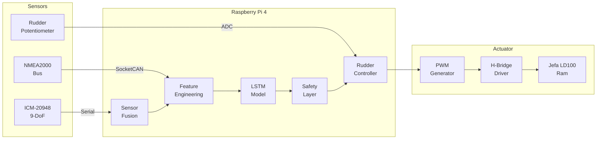
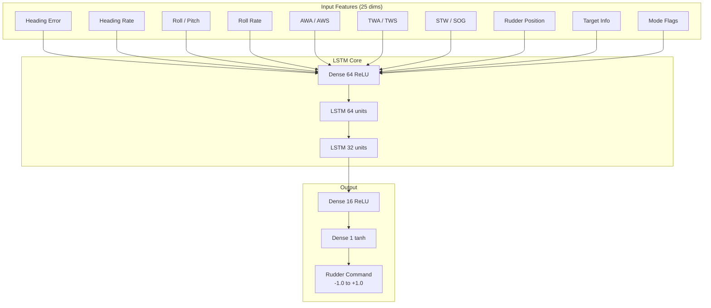
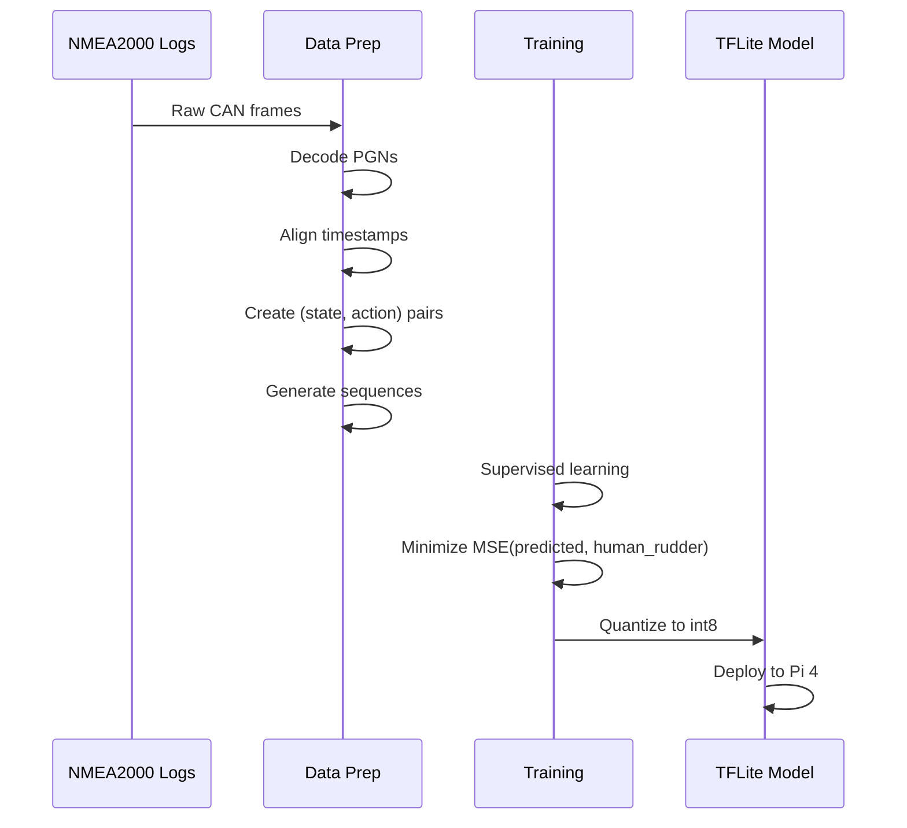

# ML-Based Yacht Autopilot for Pogo 1250

An end-to-end neural network autopilot that learns from human helming to steer a high-performance sailing yacht.

## Overview

This system replaces traditional PID/gain-based autopilots with a neural network that directly outputs rudder commands from sensor observations. The model learns yacht dynamics implicitly through imitation learning from logged human helming sessions, then fine-tunes in real-time while in standby mode.



---

## User Review Required

> [!IMPORTANT]
> **Raw CAN Log Format**: I need to understand the format of your existing NMEA2000 logs to design the data ingestion pipeline. Can you share a sample or describe the format?

> [!IMPORTANT]
> **Helmsperson Input Recording**: The model needs to learn the **relationship** between conditions and rudder movements. Do your logs include rudder position data, or will we need to add rudder logging during training voyages?

> [!WARNING]
> **Training Data Quality**: End-to-end models are only as good as the demonstrations they learn from. The training data should include:
> - Experienced helming in various conditions (light, medium, heavy air)
> - Both upwind and downwind sailing
> - Various sea states
> - **Good** helming only (poor technique will be learned)

> [!CAUTION]
> **First Sea Trials**: The initial ML model will require extensive supervised testing. Plan for:
> - Human helm ready to override at all times
> - Calm conditions for first tests
> - Gradual increase in autonomy as confidence grows

---

## Proposed Changes

### Hardware Layer

#### [NEW] [hardware_design.md](file:///Users/ieb/timefields/antigravity/autopilot/docs/hardware_design.md)
Complete hardware specification document including:

| Component | Model | Purpose | Interface |
|-----------|-------|---------|----------|
| Computer | Raspberry Pi 4 (4GB) | Main controller | - |
| CAN Interface | [CandleLite](https://linux-automation.com/en/products/candlelight.html) | NMEA2000 communication | USB → SocketCAN (`can0`) |
| 9-DoF IMU | ICM-20948 | Heading, attitude, rates | Serial (115200 baud) |
| ADC | ADS1115 | Rudder potentiometer | I²C |
| Motor Driver | BTS7960 H-Bridge | Jefa LD100 actuation | 2× PWM GPIO |
| Power | 12V → 5V DC-DC | Pi + sensors power | - |

**CAN Bus Setup:**
```bash
# CandleLite appears as gs_usb device, bring up as can0
sudo ip link set can0 up type can bitrate 250000
```

**IMU Interface Decision: Serial vs I²C**

| Factor | Serial (UART) | I²C |
|--------|---------------|-----|
| Cable length | Up to 10m with proper driver | ~1m max reliable |
| Noise immunity | Better (differential signaling possible) | Susceptible to interference |
| Isolation | Easy with optocouplers | Requires level shifters |
| Wiring | 4 wires (TX, RX, VCC, GND) | 4 wires (SDA, SCL, VCC, GND) |
| Recommendation | **Preferred** for mounting away from Pi | Only if co-located |

> [!TIP]
> **Recommendation**: Use **Serial** with the ICM-20948 on a dedicated microcontroller (e.g., Arduino Pro Mini or RP2040). This provides:
> - Physical isolation from Pi electrical noise
> - Ability to mount IMU remotely (e.g., near centerline, away from electronics)
> - Consistent 100Hz output regardless of Pi load
> - Simple protocol: MCU runs sensor fusion, sends heading/rates over serial

**PWM Control Strategy:**
- 2 PWM signals: one for port, one for starboard drive
- 10kHz PWM frequency (silent operation, smooth control)
- Duty cycle 0-100% proportional to rudder speed demand
- Lock-to-lock: 15s at full speed → ~4°/s rudder rate

---

### Sensor Fusion & Feature Engineering

#### [NEW] [imu_fusion.py](file:///Users/ieb/timefields/antigravity/autopilot/src/sensors/imu_fusion.py)
Madgwick AHRS filter implementation for ICM-20948:
- 100Hz internal fusion rate
- Outputs: heading, pitch, roll, yaw_rate, pitch_rate, roll_rate
- Magnetometer calibration routine (hard/soft iron compensation)

#### [NEW] [nmea2000_interface.py](file:///Users/ieb/timefields/antigravity/autopilot/src/sensors/nmea2000_interface.py)
NMEA2000 bus interface using `python-can` + `nmea2000` library:
- Uses standard Linux SocketCAN interface (`can0`) with CandleLite adapter
- Decodes relevant PGNs at their natural rates

> [!IMPORTANT]
> **PGN Update Rates from NMEA2000 bus are ~1Hz**, not 10Hz. This is why the dedicated 100Hz IMU is critical for the control loop.

- Key PGNs (all ~1Hz from bus):
  - **130306** Wind Data: AWA, AWS
  - **128259** Speed: STW
  - **129026** COG/SOG: COG, SOG  
  - **127250** Vessel Heading: magnetic heading (used for calibration, not control)
  - **127251** Rate of Turn: ROT (supplementary)
  - **129029** GNSS Position: lat, lon

**Implication for Control Loop:**
```
Data Source        | Rate   | Used For
-------------------|--------|---------------------------
ICM-20948 (IMU)    | 100Hz  | Heading, rates, attitude → PRIMARY control
Rudder ADC         | 50Hz   | Position feedback
NMEA2000 bus       | 1Hz    | Wind, speed, GPS → SECONDARY context
```

The ML model runs at 10Hz but the NMEA2000 values are held/interpolated between updates. The IMU provides the high-frequency feedback essential for stable steering.

---

### ML Model Architecture

> [!NOTE]
> This is the **core of your request** - the detailed ML model specification.

#### [NEW] [autopilot_model.py](file:///Users/ieb/timefields/antigravity/autopilot/src/ml/autopilot_model.py)

**Model Type:** Recurrent Neural Network (LSTM-based)

**Rationale:** 
- Sailing requires temporal context (wave patterns, wind shifts, boat momentum)
- LSTM captures these temporal dependencies naturally
- Proven feasible on Raspberry Pi 4 with TensorFlow Lite quantization



##### Input Features (25 dimensions)

| # | Feature | Source | Normalization | Rationale |
|---|---------|--------|---------------|-----------|
| 1 | `heading_error` | computed | ÷180° | Primary steering signal |
| 2 | `heading_error_integral` | computed | clip ±1 | Accumulated error (wind up prevention) |
| 3 | `heading_rate` | IMU | ÷30°/s | Damping information |
| 4 | `roll` | IMU | ÷45° | Heel angle (reef decision, comfort) |
| 5 | `pitch` | IMU | ÷30° | Pitching motion |
| 6 | `roll_rate` | IMU | ÷30°/s | Dynamic stability |
| 7 | `awa` | N2K | ÷180° | Apparent wind angle |
| 8 | `awa_rate` | computed | ÷10°/s | Wind shift indicator |
| 9 | `aws` | N2K | ÷60kn | Apparent wind speed |
| 10 | `twa` | computed | ÷180° | True wind angle |
| 11 | `tws` | computed | ÷60kn | True wind speed |
| 12 | `stw` | N2K | ÷25kn | Speed through water |
| 13 | `sog` | N2K | ÷25kn | Speed over ground |
| 14 | `cog_error` | computed | ÷180° | Course over ground error |
| 15 | `rudder_position` | ADC | ÷30° | Current rudder angle |
| 16 | `rudder_velocity` | computed | ÷10°/s | Rudder movement rate |
| 17 | `target_angle` | mode-dependent | ÷180° | Target heading/TWA/AWA |
| 18 | `vmg_upwind` | computed | ÷15kn | Velocity made good upwind |
| 19 | `vmg_downwind` | computed | ÷20kn | Velocity made good downwind |
| 20 | `polar_target_stw` | polar lookup | ÷25kn | Expected speed from polar |
| 21 | `polar_performance` | stw/target | raw (0-1.2) | % of polar speed |
| 22 | `mode_compass` | config | binary | 1 if compass mode |
| 23 | `mode_wind_awa` | config | binary | 1 if AWA mode |
| 24 | `mode_wind_twa` | config | binary | 1 if TWA mode |
| 25 | `wave_period_est` | IMU accel FFT | ÷15s | Estimated wave period |

##### Network Architecture

```python
import tensorflow as tf

def build_autopilot_model(sequence_length=20, n_features=25):
    """
    End-to-end LSTM autopilot model.
    
    Args:
        sequence_length: Number of timesteps (20 @ 10Hz = 2 seconds history)
        n_features: Input feature dimension
    
    Returns:
        Keras model outputting rudder command [-1, 1]
    """
    inputs = tf.keras.Input(shape=(sequence_length, n_features))
    
    # Initial feature mixing
    x = tf.keras.layers.TimeDistributed(
        tf.keras.layers.Dense(64, activation='relu')
    )(inputs)
    
    # Temporal processing with LSTM
    x = tf.keras.layers.LSTM(64, return_sequences=True)(x)
    x = tf.keras.layers.Dropout(0.2)(x)
    x = tf.keras.layers.LSTM(32, return_sequences=False)(x)
    x = tf.keras.layers.Dropout(0.2)(x)
    
    # Output mapping
    x = tf.keras.layers.Dense(16, activation='relu')(x)
    outputs = tf.keras.layers.Dense(1, activation='tanh')(x)  # [-1, 1]
    
    model = tf.keras.Model(inputs, outputs, name='autopilot_lstm')
    return model
```

**Model Statistics:**
- Parameters: ~45,000 (lightweight for Pi 4)
- Input: 20 timesteps × 25 features = 500 values
- Output: 1 value (rudder command, -1 = full port, +1 = full starboard)
- Inference target: <10ms (100Hz capable, running at 10Hz)

##### Sequence Window

```
Time: ... t-19  t-18  t-17  ...  t-2   t-1   t
           │     │     │         │     │    │
           └─────┴─────┴─────────┴─────┴────┘
                    20 timesteps @ 10Hz
                       = 2 second window
                              ↓
                    LSTM processes sequence
                              ↓
                    Single rudder command
```

**Why 2 seconds?**
- Captures ~1-2 wave cycles in typical offshore conditions
- Long enough to detect wind shifts
- Short enough for responsive steering
- Matches typical human reaction/correction cycle

---

### Training Pipeline

#### [NEW] [train_imitation.py](file:///Users/ieb/timefields/antigravity/autopilot/src/training/train_imitation.py)

**Phase 1: Imitation Learning (Offline)**



**Loss Function:**
```python
def autopilot_loss(y_true, y_pred):
    """
    Custom loss emphasizing:
    1. Rudder position accuracy (MSE)
    2. Rudder rate smoothness (derivative penalty)
    3. Heading error correlation
    """
    mse = tf.reduce_mean(tf.square(y_true - y_pred))
    
    # Smoothness: penalize rapid rudder changes
    rudder_rate = y_pred[1:] - y_pred[:-1]
    smoothness = tf.reduce_mean(tf.square(rudder_rate))
    
    return mse + 0.1 * smoothness
```

**Training Requirements:**
- Minimum: 10+ hours of high-quality helming data
- Recommended: 50+ hours across varied conditions
- Must include rudder position in logs

---

#### [NEW] [online_learning.py](file:///Users/ieb/timefields/antigravity/autopilot/src/training/online_learning.py)

**Phase 2: Online Fine-Tuning (Real-time)**

When in standby mode with human helming:
1. Collect current sensor state
2. Model predicts what it *would* command
3. Compare to actual human rudder input
4. Accumulate gradients in memory buffer
5. Periodically apply small weight updates

```python
class OnlineLearner:
    def __init__(self, model, learning_rate=1e-5):
        self.model = model
        self.lr = learning_rate
        self.buffer = []
        self.buffer_size = 1000  # 100 seconds of data
        
    def observe(self, state_sequence, human_rudder):
        """Record human demonstration while in standby."""
        prediction = self.model.predict(state_sequence)
        error = human_rudder - prediction
        self.buffer.append((state_sequence, human_rudder))
        
        if len(self.buffer) >= self.buffer_size:
            self._update_weights()
            
    def _update_weights(self):
        """Batch update with small learning rate."""
        # Conservative update to avoid catastrophic forgetting
        states = np.array([b[0] for b in self.buffer])
        actions = np.array([b[1] for b in self.buffer])
        
        self.model.fit(states, actions, epochs=1, batch_size=64)
        self.buffer = []
```

> [!WARNING]
> Online learning requires careful tuning to avoid:
> - Catastrophic forgetting of good behaviors
> - Learning from momentary human errors
> - Instability from high learning rates

---

### Rudder Control Loop

#### [NEW] [rudder_controller.py](file:///Users/ieb/timefields/antigravity/autopilot/src/control/rudder_controller.py)

The ML model outputs a **desired rudder position** (normalized -1 to +1).
A simple proportional controller drives the ram to achieve this position.

```python
class RudderController:
    """
    Inner control loop: ML target → PWM output.
    Runs at 50Hz (faster than ML inference).
    """
    
    def __init__(self, max_rate=4.0):  # deg/s, based on 15s lock-to-lock
        self.max_rate = max_rate
        self.kp = 0.8  # Proportional gain
        
    def update(self, target_normalized, current_position_deg, dt):
        """
        Args:
            target_normalized: ML output [-1, 1] → [-30°, +30°]
            current_position_deg: From potentiometer
            dt: Time since last update
            
        Returns:
            (pwm_port, pwm_starboard): Duty cycles 0-1
        """
        target_deg = target_normalized * 30.0  # Scale to degrees
        error = target_deg - current_position_deg
        
        # Proportional control with rate limiting
        rate_demand = np.clip(self.kp * error, -self.max_rate, self.max_rate)
        
        # Convert to PWM (one direction per channel)
        if rate_demand > 0:
            return (rate_demand / self.max_rate, 0.0)
        else:
            return (0.0, -rate_demand / self.max_rate)
```

---

### Operating Modes

#### [NEW] [mode_manager.py](file:///Users/ieb/timefields/antigravity/autopilot/src/control/mode_manager.py)

| Mode | Target Calculation | Use Case |
|------|-------------------|----------|
| **STANDBY** | No output, observe only | Human helming, online learning |
| **COMPASS** | `target = magnetic_bearing` | Motoring, fixed course |
| **WIND_AWA** | `target = target_awa` | Close-hauled, apparent wind |
| **WIND_TWA** | `target = target_twa` | Downwind, true wind |
| **VMG_UP** | Optimize `stw × cos(twa)` | Racing upwind |
| **VMG_DOWN** | Optimize `stw × cos(180-twa)` | Racing downwind |

For VMG modes, the model learns to find the optimal TWA from the polar, adjusting for current conditions.

---

### Safety Systems

#### [NEW] [safety.py](file:///Users/ieb/timefields/antigravity/autopilot/src/control/safety.py)

```python
class SafetyLayer:
    """
    Hard limits and sanity checks between ML and actuator.
    """
    
    RUDDER_LIMIT_DEG = 28.0  # Software limit (hardware is 30°)
    MAX_RUDDER_RATE = 5.0    # deg/s
    MAX_HEADING_ERROR = 45.0 # deg - disengage if exceeded
    
    def validate(self, ml_output, state):
        """
        Returns (safe_output, alarm_code).
        """
        # 1. Clamp rudder position
        output = np.clip(ml_output, -self.RUDDER_LIMIT_DEG/30, 
                         self.RUDDER_LIMIT_DEG/30)
        
        # 2. Rate limit (smooth the command)
        rate = (output - self.last_output) / self.dt
        if abs(rate) > self.MAX_RUDDER_RATE / 30:
            output = self.last_output + np.sign(rate) * self.MAX_RUDDER_RATE/30 * self.dt
            
        # 3. Heading error check
        if abs(state.heading_error) > self.MAX_HEADING_ERROR:
            return (0.0, ALARM_HEADING_DEVIATION)
            
        # 4. Sensor validity
        if state.sensor_age > 0.5:  # 500ms without fresh data
            return (0.0, ALARM_SENSOR_TIMEOUT)
            
        self.last_output = output
        return (output, OK)
```

**Manual Override Detection:**
- Monitor rudder position vs. commanded position
- If deviation exceeds threshold for >1s, assume human override
- Disengage and switch to STANDBY

---

### NMEA2000 Bus Integration

#### [NEW] [n2k_autopilot.py](file:///Users/ieb/timefields/antigravity/autopilot/src/n2k/n2k_autopilot.py)

**Transmit (status broadcasts):**
- PGN 127245 Rudder (10Hz): Current rudder angle
- PGN 127237 Heading/Track Control (4Hz): Mode, target, status
- PGN 65359 Seatalk Pilot Heading: Compatibility with Raymarine displays

**Receive (commands):**
- PGN 126208 NMEA Command: Mode changes, target adjustments
- PGN 65379 Seatalk Pilot Mode: Mode changes from Raymarine keypad
- PGN 65371 Seatalk Keypad: +1/-1 degree adjustments

---

### Project Structure

```
autopilot/
├── docs/
│   ├── hardware_design.md
│   └── wiring_diagram.png
├── src/
│   ├── sensors/
│   │   ├── imu_fusion.py
│   │   ├── nmea2000_interface.py
│   │   └── adc_reader.py
│   ├── ml/
│   │   ├── autopilot_model.py
│   │   ├── feature_engineering.py
│   │   └── polar.py
│   ├── training/
│   │   ├── data_loader.py
│   │   ├── train_imitation.py
│   │   └── online_learning.py
│   ├── control/
│   │   ├── rudder_controller.py
│   │   ├── mode_manager.py
│   │   └── safety.py
│   └── n2k/
│       ├── n2k_autopilot.py
│       └── pgn_definitions.py
├── models/
│   ├── autopilot_v1.h5
│   └── autopilot_v1.tflite
├── data/
│   └── training/
├── tests/
└── main.py
```

---

## Verification Plan

### Automated Tests

1. **Unit Tests** (pytest)
   - Feature engineering functions
   - Model input/output shapes
   - Safety layer limit enforcement
   - NMEA2000 PGN encoding/decoding

2. **Simulation** (desktop Python)
   ```bash
   python -m pytest tests/
   python simulate.py --model models/autopilot_v1.tflite --log data/test_log.can
   ```
   - Replay historical logs through model
   - Compare ML commands to human commands
   - Measure heading tracking performance

3. **Inference Latency** (on Pi 4)
   ```bash
   python benchmark.py --model models/autopilot_v1.tflite --iterations 1000
   ```
   - Target: <10ms per inference
   - Measure memory usage

### Manual Verification

1. **Bench Test**
   - Connect to Jefa LD100 on bench
   - Verify rudder follows commands smoothly
   - Test safety limits

2. **Dockside Test**
   - Full system integration at dock
   - Verify NMEA2000 communication
   - Test mode switching, alarms

3. **Sea Trials (phased)**
   - Phase 1: STANDBY only, validate data collection
   - Phase 2: Short autonomous periods, calm conditions
   - Phase 3: Extended autonomous, human ready to override
   - Phase 4: Normal operation with monitoring
