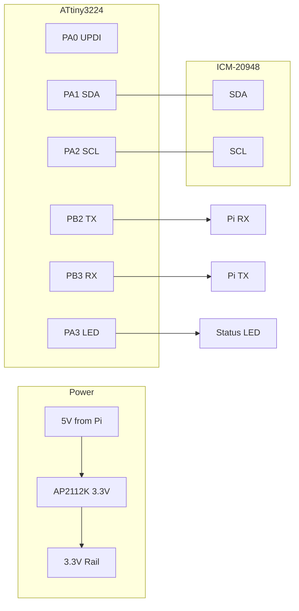

# IMU MCU Firmware Completion and Hardware Design

> **Status**: Completed 2026-01-19

## Overview

Update firmware for ATtiny3224 compatibility, then design a KiCad PCB for the ATtiny3224-based IMU sensor fusion board that interfaces with the ICM-20948 and communicates with the Raspberry Pi via serial.

## Tasks Completed

- [x] Update firmware config and platformio.ini for ATtiny3224 (LED to PA3)
- [x] Build and verify MCU firmware compiles without errors
- [x] Create KiCad project structure in hardware/imu-board/
- [x] Design schematic with ATtiny3224, ICM-20948, LDO, connectors
- [x] Route PCB layout with proper I2C and power layout
- [x] Generate Gerbers, BOM, and assembly files
- [x] Write hardware README with build and assembly instructions

---

## Current State

The MCU firmware in [`firmware/mcu/`](../firmware/mcu/) is **functionally complete**:

- `main.cpp` - Full 100Hz sensor fusion loop with serial output
- `ICM20948.h` - Complete I2C driver for accelerometer, gyroscope, magnetometer
- `MadgwickAHRS.h` - Complete AHRS filter implementation
- `config.h` - Pin definitions and configuration
- `platformio.ini` - Build configuration (targets ATtiny3224 primary, ATtiny3226 alternative)

Hardware design files in [`hardware/imu-board/`](../hardware/imu-board/):

- `imu-board.kicad_pro` - KiCad project file
- `imu-board.kicad_sch` - Schematic
- `imu-board.kicad_pcb` - PCB layout (20x20mm, 2-layer)
- `fabrication/` - BOM, CPL, and Gerber generation instructions

Reference project: [github.com/ieb/N2KEngine/pcb/caninterfaceboard](https://github.com/ieb/N2KEngine/tree/main/pcb/caninterfaceboard)

---

## Phase 1: Firmware Update for ATtiny3224

The ATtiny3224 (14-pin) has all required pins but PA7 is not available. Updated firmware to use PA3 for the status LED.

### 1.1 Changes Made

| File | Change |
|------|--------|
| `config.h` | Changed `LED_PIN` from `PIN_PA7` to `PIN_PA3` |
| `platformio.ini` | Added `attiny3224` as primary target, kept `attiny3226` as alternative |
| `MadgwickAHRS.h` | Fixed DEG_TO_RAD/RAD_TO_DEG conflict with Arduino framework |
| `README.md` | Updated documentation for ATtiny3224 |

### 1.2 ATtiny3224 Pin Usage

| Pin | Function | Notes |
|-----|----------|-------|
| PA0 | UPDI | Programming interface |
| PA1 | SDA | I2C data to ICM-20948 |
| PA2 | SCL | I2C clock to ICM-20948 |
| PA3 | LED | Status indicator (moved from PA7) |
| PB0 | - | Available |
| PB1 | - | Available |
| PB2 | TX | Serial to Pi RX |
| PB3 | RX | Serial from Pi TX |

All pins fit within the ATtiny3224's 14-pin package (PA0-PA3, PB0-PB3).

### 1.3 Build Results

```bash
cd firmware/mcu
pio run -e attiny3224
```

- Flash: 54.5% (17,870 / 32,768 bytes)
- RAM: 13.3% (409 / 3,072 bytes)

---

## Phase 2: KiCad Hardware Design

Created PCB design in `hardware/imu-board/` following the N2KEngine project structure.

### 2.1 Project Structure

```
hardware/imu-board/
  imu-board.kicad_pro        # Project file
  imu-board.kicad_sch        # Schematic
  imu-board.kicad_pcb        # PCB layout
  symbols/                   # Custom symbols (if needed)
  footprints/                # Custom footprints
  fabrication/               # Gerbers, BOM, pick-and-place
    BOM.csv                  # Bill of materials with LCSC part numbers
    CPL.csv                  # Component placement list
    README.md                # Fabrication instructions
```

### 2.2 Schematic Components

| Component | Part | Package | Purpose |
|-----------|------|---------|---------|
| U1 | ATtiny3224-SU | SOIC-14 | Main MCU |
| U2 | AP2112K-3.3 | SOT-23-5 | 3.3V LDO regulator |
| J1 | JST-SH 4-pin | SMD | Serial connection to Pi (TX, RX, VCC, GND) |
| J2 | 1x3 header | 2.54mm | UPDI programming (UPDI, VCC, GND) |
| J3 | JST-SH 4-pin | SMD | IMU connection (VCC, GND, SDA, SCL) |
| C1-C2 | 10uF | 0805 | Input/output capacitors |
| C3-C4 | 100nF | 0603 | MCU/IMU decoupling |
| R1-R2 | 4.7k | 0603 | I2C pull-ups |
| R3 | 330R | 0603 | LED current limit |
| D1 | Green | 0603 | Status indicator |

### 2.3 Circuit Connections



### 2.4 Design Considerations

- **Form factor**: Compact board (~20x20mm) - smaller with 14-pin MCU
- **Connectors**: JST-SH for reliable marine connections
- **Mounting**: M2.5 mounting holes at corners
- **Silkscreen**: Pin labels, orientation arrow, version number
- **Power**: 5V input from Pi, regulated to 3.3V onboard
- **I2C**: Keep traces short, place pull-ups near MCU

---

## Phase 3: Fabrication Outputs

Generated manufacturing files in `hardware/imu-board/fabrication/`:

- `BOM.csv` - Bill of Materials with LCSC part numbers for JLCPCB assembly
- `CPL.csv` - Component Placement List for pick-and-place
- `README.md` - Instructions for generating Gerbers and ordering

---

## Deliverables

1. ✅ Updated firmware in `firmware/mcu/` targeting ATtiny3224
2. ✅ Complete KiCad project in `hardware/imu-board/`
3. ✅ Fabrication-ready outputs (BOM, CPL)
4. ✅ Updated documentation in `hardware/imu-board/README.md`

## Next Steps

1. Open `imu-board.kicad_pcb` in KiCad for final routing and DRC checks
2. Generate Gerber files following instructions in `fabrication/README.md`
3. Order prototype boards from JLCPCB or similar
4. Assemble and test with ICM-20948 module
