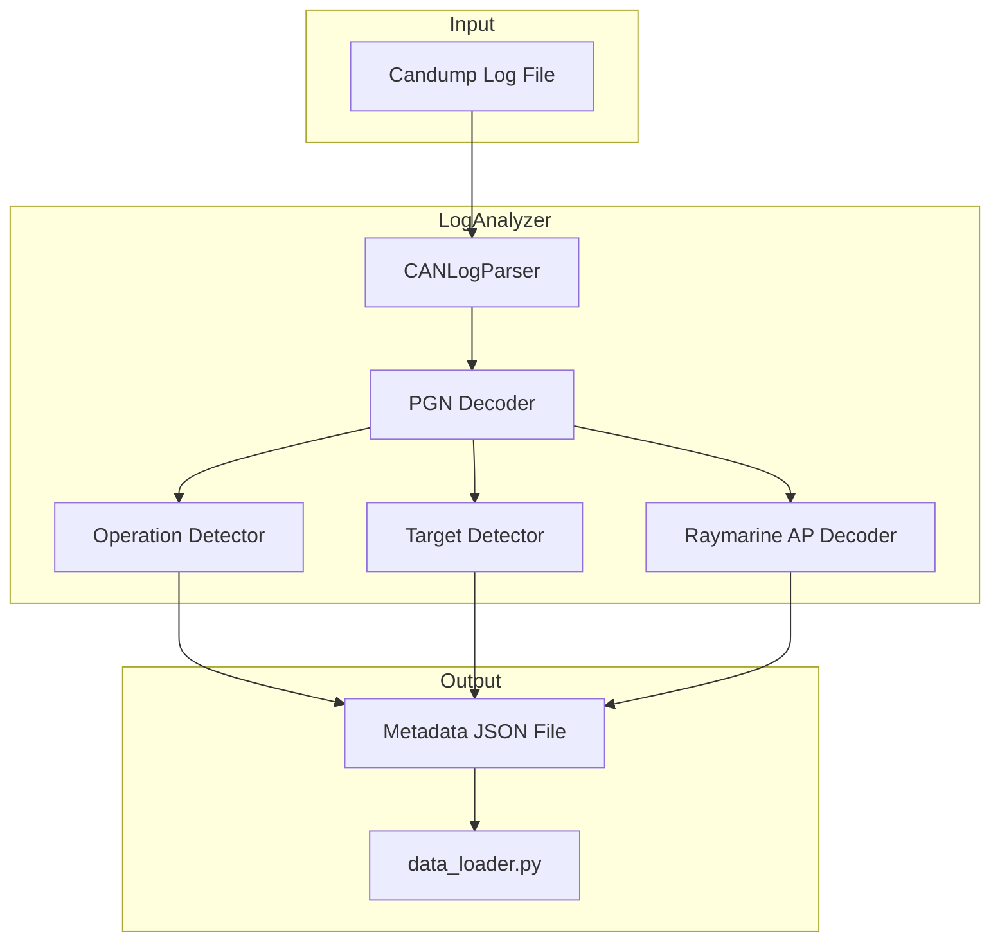

# Pre-Training Log Analysis Tool

> **Status**: Implemented in [`src/training/log_analyzer.py`](../src/training/log_analyzer.py)

## Goal

Build `src/training/log_analyzer.py` that analyzes CAN logs to label time periods with:
1. **Operation mode**: `anchor`, `motoring`, `sailing`, or `unknown`
2. **Steering target**: `heading`, `awa`, `twa`, or `none`
3. **Target value**: the actual heading/angle being maintained

The output metadata will be consumed by the existing `data_loader.py` to set `mode` and `target_heading` fields.

## Architecture



## Detection Logic

### 1. Operation Mode Detection

Based on [pre_training_analysis.md](pre_training_analysis.md):

| Mode | Detection Criteria |
|------|-------------------|
| **anchor** | SOG near 0, position wandering around fixed point, boat swinging on anchor |
| **motoring** | Engine PGNs (127488/127489) with RPM > 0, OR TWS < 6kn, OR AWA < 20deg, OR STW > 7kn (engine max), OR roll centered on zero |
| **sailing** | Constant roll offset (port or starboard), valid polar sailing angles |

### 2. Steering Target Detection

| Target Mode | Detection Criteria |
|-------------|-------------------|
| **heading** | Heading stable within tolerance over 5-30 min periods (motoring or sailing) |
| **awa** | AWA stable while heading varies, typically TWA < 130deg |
| **twa** | TWA stable while heading and AWA vary, typically TWA >= 130deg |

### 3. Raymarine Autopilot PGNs

Parse proprietary PGNs when available:
- **PGN 65359**: Seatalk Pilot Heading (already visible in logs as `"Seatalk: Pilot Heading"`)
- **PGN 126720**: Manufacturer proprietary - may contain autopilot mode/status

## Implementation Details

### Key PGNs Decoded

Extended decoder in [`src/training/data_loader.py`](../src/training/data_loader.py):

```python
# Already decoded:
- 127250: Vessel Heading
- 127245: Rudder
- 128259: Speed (STW)
- 129026: COG/SOG
- 130306: Wind

# Added:
- 127488: Engine Parameters, Rapid Update (RPM)
- 127489: Engine Parameters, Dynamic (hours, temp)
- 129025: Position, Rapid Update (lat/lon)
- 127251: Rate of Turn
- 127257: Attitude (pitch/roll)
- 65359:  Seatalk Pilot Heading (Raymarine proprietary)
```

### Metadata File Format

For each log file `candump-YYYY-MM-DD.log`, generate `candump-YYYY-MM-DD.meta.json`:

```json
{
  "source_file": "candump-2018-05-07-15-18.log",
  "analyzed_at": "2026-01-23T12:00:00Z",
  "total_duration_sec": 1800,
  "segments": [
    {
      "start_time": 1525700643.0,
      "end_time": 1525701243.0,
      "operation_mode": "motoring",
      "steering_mode": "heading",
      "target_value": 125.3,
      "confidence": 0.85,
      "notes": "Engine RPM detected, heading stable"
    },
    {
      "start_time": 1525701243.0,
      "end_time": 1525702443.0,
      "operation_mode": "sailing",
      "steering_mode": "awa",
      "target_value": 45.0,
      "confidence": 0.92,
      "notes": "Constant roll, AWA stable at 45deg"
    }
  ],
  "summary": {
    "anchor_pct": 0,
    "motoring_pct": 33,
    "sailing_pct": 67,
    "usable_for_training": true
  }
}
```

### Integration with data_loader.py

`TrainingDataLoader.load_file()` now:
1. Checks for `.meta.json` file alongside log file
2. Loads segment information
3. Sets `frame.mode` and `frame.target_heading` based on segment data
4. Filters out anchor/unknown segments from training data

## File Structure

```
src/training/
├── data_loader.py          # Extended with metadata loading
├── log_analyzer.py         # NEW - analysis tool
└── train_imitation.py      # Existing
```

## CLI Usage

```bash
# Analyze single file
python -m src.training.log_analyzer n2klogs/raw/2018/05/candump-2018-05-07-15-18.log

# Analyze directory recursively  
python -m src.training.log_analyzer n2klogs/raw/ --recursive

# Dry run - show analysis without writing files
python -m src.training.log_analyzer n2klogs/raw/ --dry-run

# Interactive mode - review and adjust segments
python -m src.training.log_analyzer n2klogs/raw/2018/05/candump-2018-05-07-15-18.log --interactive
```

## Key Classes

### OperationDetector
Detects boat operation mode from sensor data:
- Anchor detection: Low SOG + position within small radius
- Motoring detection: Engine RPM, low wind, close-hauled angle, or flat (no heel)
- Sailing detection: Heel angle or valid sailing conditions

### TargetDetector
Detects steering target mode using stability analysis:
- Heading mode: Low circular standard deviation of heading
- AWA mode: Low standard deviation of AWA while heading varies
- TWA mode: Low standard deviation of TWA (typically downwind sailing)

### LogAnalyzer
Main orchestrator that:
- Parses log files using CANLogParser
- Analyzes in sliding time windows
- Merges adjacent similar segments
- Generates summary statistics
- Saves metadata JSON files

## Tests

30 unit tests in [`tests/test_log_analyzer.py`](../tests/test_log_analyzer.py) covering:
- Operation mode detection (anchor, motoring, sailing)
- Steering target detection (heading, AWA, TWA)
- Metadata generation and parsing
- DataLoader integration
- PGN decoding for new fields
- Real log file analysis
