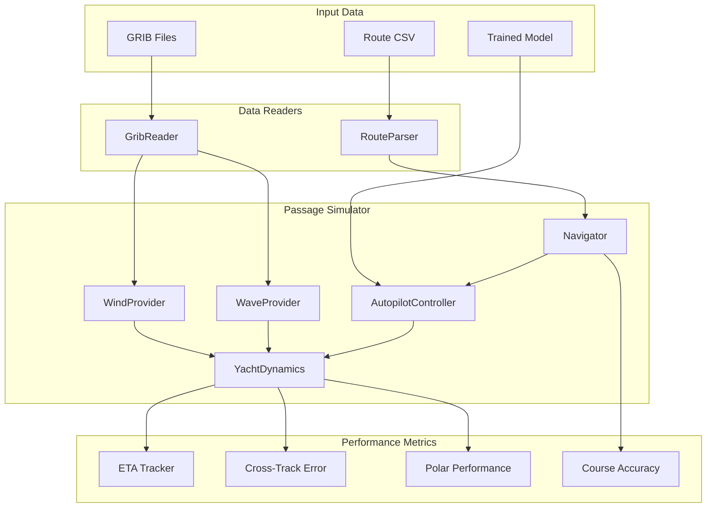

# Planned Passage Experiment Implementation Plan

## Overview

Build a simulation framework that tests the autopilot model's ability to follow a pre-planned sailing route. The experiment uses real weather data from GRIB files, a planned route from CSV, and the trained LSTM autopilot model to steer the yacht.

## Architecture



## Package Structure

```
experiments/
  experiment1/
    __init__.py
    grib_reader.py      # GRIB file parser using cfgrib/xarray
    route_parser.py     # CSV route parser with waypoint handling
    wind_provider.py    # Interpolates GRIB wind data for position/time
    wave_provider.py    # Interpolates GRIB wave data for sea state
    navigator.py        # Waypoint navigation and steering mode logic
    passage_simulator.py # Main simulation orchestrator
    metrics.py          # Performance tracking and reporting
    run_experiment.py   # CLI entry point
```

## Key Components

### 1. Route Parser

Parses the route CSV file with columns:
- Isochrone timestamp, From/To coordinates, COG, SOG, TWS, TWD, Surface Wind Angle, motoring flag
- Converts coordinate format (e.g., `51°56.578'N` → decimal degrees)
- Creates list of `Waypoint` dataclasses with navigation data

### 2. GRIB Reader

Reads compressed GRIB files using `cfgrib` + `xarray`:
- Wind parameters: U10, V10 (10m wind components) or UGRD/VGRD
- Wave parameters: significant wave height, wave period, wave direction
- Handles multiple resolution files (4km and 12km) - merge/select based on position

### 3. Wind/Wave Providers

Spatiotemporal interpolation of GRIB data:
- Bilinear interpolation in space
- Linear interpolation in time between forecast steps
- Returns TWS/TWD for wind, Hs/Tp/Dir for waves

### 4. Navigator

Manages route following:
- Tracks current leg (from waypoint to next waypoint)
- Computes bearing to next waypoint
- Determines steering mode using conventional logic:
  - **AWA mode**: When |TWA| between 30-120 degrees (upwind/reaching)
  - **TWA mode**: When |TWA| > 120 degrees (running/broad reaching)
- Handles motoring mode (hold COG at ~6 knots STW)
- Detects waypoint arrival (distance threshold ~0.1nm)

### 5. Passage Simulator

Main simulation loop:
1. Initialize yacht at starting position with route heading
2. For each timestep (0.1s):
   - Query wind provider for current TWS/TWD at yacht position
   - Query wave provider for sea state
   - Navigator determines target (heading/AWA/TWA) and mode
   - Feature engineering creates model input from sensor state
   - Autopilot model predicts rudder command (or helm controller for baseline)
   - Yacht dynamics steps forward
   - Metrics recorder logs performance
3. Continue until reaching destination or timeout

### 6. Metrics Tracker

Tracks comprehensive performance metrics:

| Metric | Description | Calculation |
|--------|-------------|-------------|
| ETA Error | Difference between actual and planned arrival | `actual_time - planned_time` |
| Cross-Track Error | Perpendicular distance from planned track | Great circle distance to track line |
| Polar Performance | Ratio of actual vs. target STW | `STW / polar.get_target_speed(TWA, TWS)` |
| Course Accuracy | RMS error of heading vs. target | `sqrt(mean(heading_error^2))` |
| Leg Times | Per-leg timing analysis | Actual vs. planned per waypoint |

Outputs:
- Summary statistics (JSON)
- Time-series data (CSV for plotting)
- Performance report (Markdown or console)

### 7. Experiment Runner

CLI interface with options for route, GRIB data, model selection, and output.

## Implementation Tasks (Completed)

1. **Package Setup** - Create experiments/experiment1/ package structure
2. **Route Parser** - Parse CSV, convert coordinates, create waypoint list
3. **GRIB Reader** - Decompress and read GRIB files, extract wind/wave fields
4. **Wind/Wave Providers** - Interpolation logic for position/time queries
5. **Navigator** - Waypoint tracking, steering mode selection, bearing calculation
6. **Metrics** - Performance tracking framework
7. **Passage Simulator** - Integration of all components with simulation loop
8. **Experiment Runner** - CLI and output generation
9. **Dependencies** - Update pyproject.toml with cfgrib, xarray, eccodes
10. **Testing and Validation** - Verify against expected route data

## Dependencies Added

```toml
[project.optional-dependencies]
experiment = [
    "cfgrib>=0.9.10",
    "xarray>=2023.1.0",
    "eccodes>=1.5.0",
]
```

## Bug Fix

During implementation, a bug was discovered in `src/simulation/yacht_dynamics.py` where the position update calculation was incorrect. The conversion from knots to degrees per second was 60x too fast:

- **Bug**: `speed_deg_per_sec = self.state.sog / 3600.0`
- **Fix**: `speed_deg_per_sec = self.state.sog / 216000.0`

This was corrected as part of the implementation.
