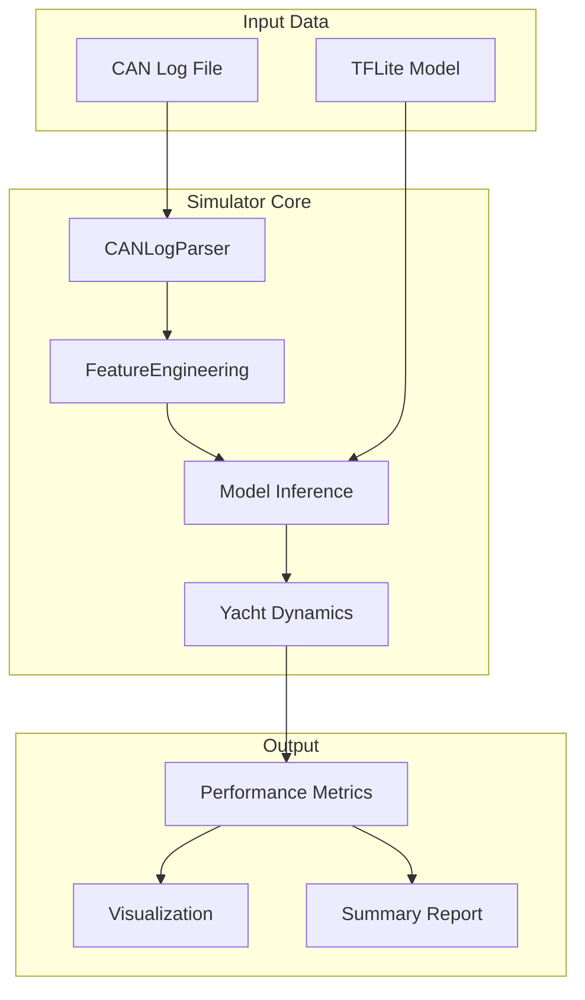

# Simulation Sub-Plan

This sub-plan implements **Step 2 of the Verification Plan** (lines 1018-1025 of [implementation_plan.md](implementation_plan.md)) to validate the autopilot model using historical log data before hardware deployment.

## Status: Pending

Requires a trained model before execution.

## Objectives

1. **Replay historical logs through model** - Feed recorded sensor data into the ML model
2. **Compare ML commands to human commands** - Measure how closely the model matches human helming
3. **Measure heading tracking performance** - Simulate closed-loop behavior and track heading error

---

## Architecture



---

## Files to Create

### 1. Main Simulation Script

**File:** `simulate.py` (project root)

Entry point for running simulations from command line:

```bash
# Basic usage
python simulate.py --model models/autopilot_v1.tflite --log data/test_log.can

# With options
python simulate.py --model models/autopilot_v1.tflite \
    --log n2klogs/raw/2018/05/candump-2018-05-07-15-18.log \
    --output results/ \
    --plot
```

Key functionality:

- Load TFLite model (or use MockAutopilotInference if no model)
- Parse log file using existing [data_loader.py](../src/training/data_loader.py) `CANLogParser`
- Feed data through [feature_engineering.py](../src/ml/feature_engineering.py)
- Run inference and collect predictions
- Compute metrics and optionally generate plots

### 2. Simulation Engine

**File:** `src/simulation/simulator.py`

Core simulation logic:

```python
@dataclass
class SimulationConfig:
    sample_rate_hz: float = 10.0      # Simulation rate
    closed_loop: bool = False          # True = simulate yacht dynamics
    rudder_rate_limit: float = 4.0     # deg/s (Jefa LD100 spec)
    heading_rate_per_rudder: float = 2.0  # deg/s per deg rudder (yacht response)

@dataclass 
class SimulationResult:
    timestamps: np.ndarray
    human_rudder: np.ndarray           # Actual human commands from log
    ml_rudder: np.ndarray              # ML model predictions
    heading_actual: np.ndarray         # Actual heading from log
    heading_simulated: np.ndarray      # Simulated heading (closed-loop)
    metrics: dict                       # Performance metrics
```

### 3. Yacht Dynamics Model (for closed-loop simulation)

**File:** `src/simulation/yacht_dynamics.py`

Simple first-order yacht response model for closed-loop testing:

```python
class YachtDynamics:
    """
    Simplified yacht dynamics for heading simulation.
    
    Model: heading_rate = k * rudder_angle + disturbance
    """
    def __init__(self, k: float = 2.0, damping: float = 0.8):
        self.k = k              # Rudder effectiveness (deg/s per deg)
        self.damping = damping  # Heading rate damping
        self.heading = 0.0
        self.heading_rate = 0.0
        
    def step(self, rudder_angle: float, dt: float, 
             wind_disturbance: float = 0.0) -> float:
        """Simulate one timestep, return new heading."""
        target_rate = self.k * rudder_angle + wind_disturbance
        self.heading_rate = self.damping * self.heading_rate + \
                           (1 - self.damping) * target_rate
        self.heading += self.heading_rate * dt
        return self.heading
```

### 4. Metrics Calculator

**File:** `src/simulation/metrics.py`

Performance metrics comparing ML to human:

| Metric | Description | Target |
|--------|-------------|--------|
| `rudder_mae` | Mean Absolute Error between ML and human rudder | < 3 degrees |
| `rudder_rmse` | Root Mean Square Error | < 5 degrees |
| `rudder_correlation` | Pearson correlation coefficient | > 0.8 |
| `heading_error_mean` | Mean heading error (closed-loop) | < 5 degrees |
| `heading_error_std` | Heading error standard deviation | < 10 degrees |
| `heading_error_max` | Maximum heading deviation | < 30 degrees |
| `smoothness_score` | Rudder rate smoothness (lower = smoother) | < human |
| `reaction_delay` | Average delay in response to heading changes | < 0.5s |

```python
def compute_metrics(human_rudder: np.ndarray, 
                    ml_rudder: np.ndarray,
                    heading_error: np.ndarray = None) -> dict:
    """Compute all performance metrics."""
    return {
        'rudder_mae': np.mean(np.abs(human_rudder - ml_rudder)),
        'rudder_rmse': np.sqrt(np.mean((human_rudder - ml_rudder)**2)),
        'rudder_correlation': np.corrcoef(human_rudder, ml_rudder)[0,1],
        'human_smoothness': compute_smoothness(human_rudder),
        'ml_smoothness': compute_smoothness(ml_rudder),
        # ... heading metrics if closed-loop
    }
```

### 5. Visualization

**File:** `src/simulation/plotting.py`

Generate diagnostic plots:

1. **Time series comparison** - Human vs ML rudder commands over time
2. **Heading tracking** - Target heading, actual heading, simulated heading
3. **Scatter plot** - Human rudder vs ML rudder (correlation)
4. **Error histogram** - Distribution of prediction errors
5. **Smoothness comparison** - Rudder rate histograms

---

## Implementation Details

### Using Existing Infrastructure

The simulation will leverage existing code:

- **[CANLogParser](../src/training/data_loader.py)** (lines 59-223) - Already parses candump and JSON log formats
- **[FeatureEngineering](../src/ml/feature_engineering.py)** - Creates normalized feature sequences
- **[MockAutopilotInference](../src/ml/autopilot_model.py)** (lines 281-305) - Fallback when no trained model available
- **[Polar](../src/ml/polar.py)** - For VMG and polar performance calculations

### Log Format Support

Based on existing logs in `n2klogs/`:

| Format | Example | Parser |
|--------|---------|--------|
| JSON lines | `sample.jsonlog` | `_parse_json()` |
| candump | `candump-2018-05-07-15-18.log` | `_parse_candump()` |
| CSV | (supported) | `_parse_csv()` |

The JSON log format (from `sample.jsonlog`) contains:

- PGN 127250: Heading (radians)
- PGN 127245: Rudder position (radians)
- PGN 130306: Wind data
- PGN 129026: COG/SOG
- PGN 128259: Speed

### Open-Loop vs Closed-Loop Simulation

**Open-loop (default):**

- Uses actual heading from log
- Compares ML prediction to human rudder at each timestep
- Good for measuring ML accuracy

**Closed-loop:**

- Uses simulated yacht dynamics
- ML controls heading, compare to target
- Good for measuring heading tracking performance

---

## Directory Structure

```
autopilot/
├── simulate.py                    # Entry point script
├── src/
│   └── simulation/
│       ├── __init__.py
│       ├── simulator.py           # Core simulation engine
│       ├── yacht_dynamics.py      # Simple yacht model
│       ├── metrics.py             # Performance metrics
│       └── plotting.py            # Visualization
├── tests/
│   └── test_simulation.py         # Unit tests
└── results/                       # Output directory (created on run)
```

---

## Test Data

Use existing logs for testing:

1. **Development testing:** `n2klogs/analysed/sample.jsonlog` - Short, parsed JSON format
2. **Integration testing:** `n2klogs/raw/2018/05/candump-2018-05-07-15-18.log` - Real sailing data
3. **Batch testing:** `n2klogs/raw/` - Multiple sessions for validation

---

## Success Criteria

The simulation passes if:

1. **Rudder MAE < 5 degrees** - ML commands are close to human
2. **Correlation > 0.7** - ML responds to same inputs as human
3. **ML smoothness <= human smoothness** - No jittery commands
4. **Closed-loop heading error < 10 degrees mean** - Acceptable tracking
5. **No heading excursions > 45 degrees** - Safety maintained

---

## Usage Examples

```bash
# Run with mock inference (no trained model needed)
python simulate.py --log n2klogs/analysed/sample.jsonlog --mock

# Run with trained model
python simulate.py --model models/autopilot_v1.tflite \
    --log n2klogs/raw/2018/05/candump-2018-05-07-15-18.log

# Closed-loop simulation with plots
python simulate.py --model models/autopilot_v1.tflite \
    --log n2klogs/raw/2018/05/candump-2018-05-07-15-18.log \
    --closed-loop --plot --output results/

# Batch run on all logs
python simulate.py --model models/autopilot_v1.tflite \
    --log-dir n2klogs/raw/ --output results/batch/
```

---

## Dependencies

Already in [pyproject.toml](../pyproject.toml):

- `numpy` - Numerical operations
- `tensorflow` or `tflite-runtime` - Model inference

Optional (for plotting):

- `matplotlib` - Already in `[project.optional-dependencies] viz`

---

## Tasks

1. Create src/simulation/ directory with __init__.py
2. Implement yacht_dynamics.py - simple first-order heading response model
3. Implement metrics.py - MAE, RMSE, correlation, smoothness, heading error metrics
4. Implement simulator.py - core simulation engine using existing CANLogParser and FeatureEngineering
5. Implement plotting.py - time series, scatter, histogram plots
6. Implement simulate.py entry point with CLI argument parsing
7. Add test_simulation.py with unit tests for metrics and yacht dynamics
8. Run simulation on existing logs (sample.jsonlog, candump files) and verify metrics
